# Sơ đồ thiết kế lớp chi tiết cho module "Ký hợp đồng với khách thuê lao động"

## 1. Tổng quan về module

Module "Ký hợp đồng với khách thuê lao động" bao gồm 3 microservice chính:
- **customer-contract-service**: Quản lý hợp đồng với khách hàng thuê lao động
- **customer-service**: Quản lý thông tin khách hàng
- **job-service**: Quản lý thông tin loại công việc

## 2. Sơ đồ lớp chi tiết

```mermaid
classDiagram
    %% CUSTOMER-CONTRACT-SERVICE
    class CustomerContract {
        -Long id
        -String contractCode
        -LocalDate startingDate
        -LocalDate endingDate
        -LocalDate signedDate
        -Integer numberOfWorkers
        -Double totalAmount
        -String address
        -String description
        -Long jobCategoryId
        -Long customerId
        -Integer status
        -Boolean isDeleted
        -LocalDateTime createdAt
        -LocalDateTime updatedAt
    }

    class CustomerContractRepository {
        +findByIsDeletedFalse()
        +findByIdAndIsDeletedFalse(Long id)
        +findByCustomerIdAndIsDeletedFalse(Long customerId)
        +findByStatusAndIsDeletedFalse(Integer status)
        +findByStartingDateBetweenAndIsDeletedFalse(LocalDate startDate, LocalDate endDate)
        +findByJobCategoryIdAndIsDeletedFalse(Long jobCategoryId)
    }

    class ICustomerContractService {
        <<interface>>
        +createContract(CustomerContract contract)
        +updateContract(CustomerContract contract)
        +deleteContract(Long id)
        +getContractById(Long id)
        +getAllContracts()
        +getContractsByCustomerId(Long customerId)
        +getContractsByStatus(Integer status)
        +getContractsByDateRange(LocalDate startDate, LocalDate endDate)
        +getContractsByJobCategoryId(Long jobCategoryId)
        +updateContractStatus(Long id, Integer status)
        +signContract(Long id, LocalDate signedDate)
        +checkContractExists(Long id)
    }

    class CustomerContractServiceImpl {
        -CustomerContractRepository contractRepository
        -CustomerClient customerClient
        -JobCategoryClient jobCategoryClient
    }

    class CustomerContractController {
        -ICustomerContractService contractService
    }

    class CustomerClient {
        <<interface>>
        +getCustomerById(Long id)
        +checkCustomerExists(Long id)
    }

    class JobCategoryClient {
        <<interface>>
        +getJobCategoryById(Long id)
        +checkJobCategoryExists(Long id)
    }

    class ContractStatusConstants {
        +PENDING: int = 0
        +ACTIVE: int = 1
        +COMPLETED: int = 2
        +CANCELLED: int = 3
        +getStatusName(int status)
    }

    %% CUSTOMER-SERVICE
    class Customer {
        -Long id
        -String fullName
        -String companyName
        -String phoneNumber
        -String email
        -String address
        -Boolean isDeleted
        -LocalDateTime createdAt
        -LocalDateTime updatedAt
    }

    class CustomerRepository {
        +findByIsDeletedFalse()
        +findByIdAndIsDeletedFalse(Long id)
        +existsByEmailAndIsDeletedFalse(String email)
        +existsByPhoneNumberAndIsDeletedFalse(String phoneNumber)
        +existsByEmailAndIsDeletedFalseAndIdNot(String email, Long id)
        +existsByPhoneNumberAndIsDeletedFalseAndIdNot(String phoneNumber, Long id)
    }

    class ICustomerService {
        <<interface>>
        +createCustomer(Customer customer)
        +updateCustomer(Customer customer)
        +deleteCustomer(Long id)
        +getCustomerById(Long id)
        +getAllCustomers()
        +checkCustomerExists(Long id)
    }

    class CustomerServiceImpl {
        -CustomerRepository customerRepository
    }

    class CustomerController {
        -ICustomerService customerService
    }

    %% JOB-SERVICE
    class JobCategory {
        -Long id
        -String name
        -String description
        -Double baseSalary
        -Boolean isDeleted
        -LocalDateTime createdAt
        -LocalDateTime updatedAt
    }

    class JobCategoryRepository {
        +findByIsDeletedFalse()
        +findByIdAndIsDeletedFalse(Long id)
        +existsByNameAndIsDeletedFalse(String name)
        +existsByNameAndIsDeletedFalseAndIdNot(String name, Long id)
    }

    class IJobCategoryService {
        <<interface>>
        +createJobCategory(JobCategory jobCategory)
        +updateJobCategory(JobCategory jobCategory)
        +deleteJobCategory(Long id)
        +getJobCategoryById(Long id)
        +getAllJobCategories()
        +checkJobCategoryExists(Long id)
    }

    class JobCategoryServiceImpl {
        -JobCategoryRepository jobCategoryRepository
    }

    class JobCategoryController {
        -IJobCategoryService jobCategoryService
    }

    %% RELATIONSHIPS

    %% customer-contract-service relationships
    CustomerContractController --> ICustomerContractService : uses
    CustomerContractServiceImpl ..|> ICustomerContractService : implements
    CustomerContractServiceImpl --> CustomerContractRepository : uses
    CustomerContractServiceImpl --> CustomerClient : uses
    CustomerContractServiceImpl --> JobCategoryClient : uses
    CustomerContractServiceImpl --> ContractStatusConstants : uses
    CustomerContractRepository --> CustomerContract : manages

    %% customer-service relationships
    CustomerController --> ICustomerService : uses
    CustomerServiceImpl ..|> ICustomerService : implements
    CustomerServiceImpl --> CustomerRepository : uses
    CustomerRepository --> Customer : manages

    %% job-service relationships
    JobCategoryController --> IJobCategoryService : uses
    JobCategoryServiceImpl ..|> IJobCategoryService : implements
    JobCategoryServiceImpl --> JobCategoryRepository : uses
    JobCategoryRepository --> JobCategory : manages

    %% cross-service relationships
    CustomerClient ..> Customer : references
    JobCategoryClient ..> JobCategory : references
    CustomerContract --> Customer : references via customerId
    CustomerContract --> JobCategory : references via jobCategoryId
```

## 3. Mô tả chi tiết các lớp

### 3.1. customer-contract-service

#### 3.1.1. Model
- **CustomerContract**: Entity đại diện cho hợp đồng với khách hàng
  - Thuộc tính:
    - id: Định danh hợp đồng
    - contractCode: Mã hợp đồng
    - startingDate: Ngày bắt đầu
    - endingDate: Ngày kết thúc
    - signedDate: Ngày ký hợp đồng
    - numberOfWorkers: Số lượng nhân công cần
    - totalAmount: Tổng giá trị hợp đồng
    - address: Địa chỉ làm việc
    - description: Mô tả công việc
    - jobCategoryId: ID loại công việc (tham chiếu đến JobCategory)
    - customerId: ID khách hàng (tham chiếu đến Customer)
    - status: Trạng thái hợp đồng (0: Chờ xử lý, 1: Đang hoạt động, 2: Hoàn thành, 3: Đã hủy)
    - isDeleted: Đánh dấu đã xóa
    - createdAt: Thời điểm tạo
    - updatedAt: Thời điểm cập nhật

- **Customer**: Model đại diện cho khách hàng (được sử dụng trong CustomerClient)
  - Thuộc tính:
    - id: Định danh khách hàng
    - fullName: Tên đầy đủ
    - companyName: Tên công ty
    - phoneNumber: Số điện thoại
    - email: Email
    - address: Địa chỉ
    - isDeleted: Đánh dấu đã xóa
    - createdAt: Thời điểm tạo
    - updatedAt: Thời điểm cập nhật

- **JobCategory**: Model đại diện cho loại công việc (được sử dụng trong JobCategoryClient)
  - Thuộc tính:
    - id: Định danh loại công việc
    - name: Tên loại công việc
    - description: Mô tả
    - baseSalary: Mức lương cơ bản
    - isDeleted: Đánh dấu đã xóa
    - createdAt: Thời điểm tạo
    - updatedAt: Thời điểm cập nhật

#### 3.1.2. Repository
- **CustomerContractRepository**: Interface kế thừa JpaRepository để thao tác với entity CustomerContract
  - Phương thức:
    - findByIsDeletedFalse(): Tìm tất cả hợp đồng chưa xóa
    - findByIdAndIsDeletedFalse(Long id): Tìm hợp đồng theo ID
    - findByCustomerIdAndIsDeletedFalse(Long customerId): Tìm hợp đồng theo ID khách hàng
    - findByStatusAndIsDeletedFalse(Integer status): Tìm hợp đồng theo trạng thái
    - findByStartingDateBetweenAndIsDeletedFalse(LocalDate startDate, LocalDate endDate): Tìm hợp đồng trong khoảng thời gian
    - findByJobCategoryIdAndIsDeletedFalse(Long jobCategoryId): Tìm hợp đồng theo ID loại công việc

#### 3.1.3. Service
- **ICustomerContractService**: Interface định nghĩa các phương thức xử lý nghiệp vụ liên quan đến hợp đồng
  - Phương thức:
    - createContract(CustomerContract contract): Tạo hợp đồng mới
    - updateContract(CustomerContract contract): Cập nhật hợp đồng
    - deleteContract(Long id): Xóa hợp đồng
    - getContractById(Long id): Lấy hợp đồng theo ID
    - getAllContracts(): Lấy tất cả hợp đồng
    - getContractsByCustomerId(Long customerId): Lấy hợp đồng theo ID khách hàng
    - getContractsByStatus(Integer status): Lấy hợp đồng theo trạng thái
    - getContractsByDateRange(LocalDate startDate, LocalDate endDate): Lấy hợp đồng trong khoảng thời gian
    - getContractsByJobCategoryId(Long jobCategoryId): Lấy hợp đồng theo ID loại công việc
    - updateContractStatus(Long id, Integer status): Cập nhật trạng thái hợp đồng
    - signContract(Long id, LocalDate signedDate): Ký hợp đồng
    - checkContractExists(Long id): Kiểm tra hợp đồng tồn tại

- **CustomerContractServiceImpl**: Lớp triển khai ICustomerContractService
  - Thuộc tính:
    - contractRepository: CustomerContractRepository
    - customerClient: CustomerClient
    - jobCategoryClient: JobCategoryClient
  - Phương thức: Triển khai các phương thức từ interface

#### 3.1.4. Controller
- **CustomerContractController**: REST Controller xử lý các request liên quan đến hợp đồng
  - Thuộc tính:
    - contractService: ICustomerContractService
  - Endpoint:
    - GET /api/customer-contract/{id}: Lấy hợp đồng theo ID
    - POST /api/customer-contract: Tạo hợp đồng mới
    - PUT /api/customer-contract: Cập nhật hợp đồng
    - DELETE /api/customer-contract/{id}: Xóa hợp đồng
    - GET /api/customer-contract: Lấy tất cả hợp đồng
    - GET /api/customer-contract/customer/{customerId}: Lấy hợp đồng theo ID khách hàng
    - GET /api/customer-contract/status/{status}: Lấy hợp đồng theo trạng thái
    - GET /api/customer-contract/date-range: Lấy hợp đồng trong khoảng thời gian
    - GET /api/customer-contract/job-category/{jobCategoryId}: Lấy hợp đồng theo ID loại công việc
    - PUT /api/customer-contract/{id}/status/{status}: Cập nhật trạng thái hợp đồng
    - PUT /api/customer-contract/{id}/sign: Ký hợp đồng

#### 3.1.5. Client
- **CustomerClient**: Feign Client để gọi API từ customer-service
  - Phương thức:
    - getCustomerById(Long id): Lấy thông tin khách hàng theo ID
    - checkCustomerExists(Long id): Kiểm tra khách hàng tồn tại

- **JobCategoryClient**: Feign Client để gọi API từ job-service
  - Phương thức:
    - getJobCategoryById(Long id): Lấy thông tin loại công việc theo ID
    - checkJobCategoryExists(Long id): Kiểm tra loại công việc tồn tại

#### 3.1.6. Constants
- **ContractStatusConstants**: Lớp chứa các hằng số trạng thái hợp đồng
  - Hằng số:
    - PENDING: 0 (Chờ xử lý)
    - ACTIVE: 1 (Đang hoạt động)
    - COMPLETED: 2 (Hoàn thành)
    - CANCELLED: 3 (Đã hủy)
  - Phương thức:
    - getStatusName(int status): Lấy tên trạng thái

### 3.2. customer-service

#### 3.2.1. Model
- **Customer**: Entity đại diện cho khách hàng
  - Thuộc tính:
    - id: Định danh khách hàng
    - fullName: Tên đầy đủ
    - companyName: Tên công ty
    - phoneNumber: Số điện thoại
    - email: Email
    - address: Địa chỉ
    - isDeleted: Đánh dấu đã xóa
    - createdAt: Thời điểm tạo
    - updatedAt: Thời điểm cập nhật

#### 3.2.2. Repository
- **CustomerRepository**: Interface kế thừa JpaRepository để thao tác với entity Customer
  - Phương thức:
    - findByIsDeletedFalse(): Tìm tất cả khách hàng chưa xóa
    - findByIdAndIsDeletedFalse(Long id): Tìm khách hàng theo ID
    - existsByEmailAndIsDeletedFalse(String email): Kiểm tra email đã tồn tại
    - existsByPhoneNumberAndIsDeletedFalse(String phoneNumber): Kiểm tra số điện thoại đã tồn tại
    - existsByEmailAndIsDeletedFalseAndIdNot(String email, Long id): Kiểm tra email đã tồn tại (trừ ID)
    - existsByPhoneNumberAndIsDeletedFalseAndIdNot(String phoneNumber, Long id): Kiểm tra số điện thoại đã tồn tại (trừ ID)

#### 3.2.3. Service
- **ICustomerService**: Interface định nghĩa các phương thức xử lý nghiệp vụ liên quan đến khách hàng
  - Phương thức:
    - createCustomer(Customer customer): Tạo khách hàng mới
    - updateCustomer(Customer customer): Cập nhật khách hàng
    - deleteCustomer(Long id): Xóa khách hàng
    - getCustomerById(Long id): Lấy khách hàng theo ID
    - getAllCustomers(): Lấy tất cả khách hàng
    - checkCustomerExists(Long id): Kiểm tra khách hàng tồn tại

- **CustomerServiceImpl**: Lớp triển khai ICustomerService
  - Thuộc tính:
    - customerRepository: CustomerRepository
  - Phương thức: Triển khai các phương thức từ interface

#### 3.2.4. Controller
- **CustomerController**: REST Controller xử lý các request liên quan đến khách hàng
  - Thuộc tính:
    - customerService: ICustomerService
  - Endpoint:
    - GET /api/customer/{id}: Lấy khách hàng theo ID
    - POST /api/customer: Tạo khách hàng mới
    - PUT /api/customer: Cập nhật khách hàng
    - DELETE /api/customer/{id}: Xóa khách hàng
    - GET /api/customer: Lấy tất cả khách hàng
    - GET /api/customer/{id}/check-customer-exists: Kiểm tra khách hàng tồn tại

### 3.3. job-service

#### 3.3.1. Model
- **JobCategory**: Entity đại diện cho loại công việc
  - Thuộc tính:
    - id: Định danh loại công việc
    - name: Tên loại công việc
    - description: Mô tả
    - baseSalary: Mức lương cơ bản
    - isDeleted: Đánh dấu đã xóa
    - createdAt: Thời điểm tạo
    - updatedAt: Thời điểm cập nhật

#### 3.3.2. Repository
- **JobCategoryRepository**: Interface kế thừa JpaRepository để thao tác với entity JobCategory
  - Phương thức:
    - findByIsDeletedFalse(): Tìm tất cả loại công việc chưa xóa
    - findByIdAndIsDeletedFalse(Long id): Tìm loại công việc theo ID
    - existsByNameAndIsDeletedFalse(String name): Kiểm tra tên đã tồn tại
    - existsByNameAndIsDeletedFalseAndIdNot(String name, Long id): Kiểm tra tên đã tồn tại (trừ ID)

#### 3.3.3. Service
- **IJobCategoryService**: Interface định nghĩa các phương thức xử lý nghiệp vụ liên quan đến loại công việc
  - Phương thức:
    - createJobCategory(JobCategory jobCategory): Tạo loại công việc mới
    - updateJobCategory(JobCategory jobCategory): Cập nhật loại công việc
    - deleteJobCategory(Long id): Xóa loại công việc
    - getJobCategoryById(Long id): Lấy loại công việc theo ID
    - getAllJobCategories(): Lấy tất cả loại công việc
    - checkJobCategoryExists(Long id): Kiểm tra loại công việc tồn tại

- **JobCategoryServiceImpl**: Lớp triển khai IJobCategoryService
  - Thuộc tính:
    - jobCategoryRepository: JobCategoryRepository
  - Phương thức: Triển khai các phương thức từ interface

#### 3.3.4. Controller
- **JobCategoryController**: REST Controller xử lý các request liên quan đến loại công việc
  - Thuộc tính:
    - jobCategoryService: IJobCategoryService
  - Endpoint:
    - GET /api/job-category/{id}: Lấy loại công việc theo ID
    - POST /api/job-category: Tạo loại công việc mới
    - PUT /api/job-category: Cập nhật loại công việc
    - DELETE /api/job-category/{id}: Xóa loại công việc
    - GET /api/job-category: Lấy tất cả loại công việc
    - GET /api/job-category/{id}/check-job-category-exists: Kiểm tra loại công việc tồn tại

## 4. Mối quan hệ giữa các lớp

### 4.1. Mối quan hệ trong customer-contract-service
- **CustomerContractController** sử dụng **ICustomerContractService** để xử lý các request
- **CustomerContractServiceImpl** triển khai **ICustomerContractService** và sử dụng:
  - **CustomerContractRepository** để thao tác với dữ liệu hợp đồng
  - **CustomerClient** để gọi API từ customer-service
  - **JobCategoryClient** để gọi API từ job-service
- **CustomerContract** có quan hệ với **Customer** và **JobCategory** thông qua ID tham chiếu (customerId và jobCategoryId)
- **ContractStatusConstants** được sử dụng trong **CustomerContractServiceImpl** để xác định trạng thái hợp đồng

### 4.2. Mối quan hệ trong customer-service
- **CustomerController** sử dụng **ICustomerService** để xử lý các request
- **CustomerServiceImpl** triển khai **ICustomerService** và sử dụng **CustomerRepository** để thao tác với dữ liệu khách hàng

### 4.3. Mối quan hệ trong job-service
- **JobCategoryController** sử dụng **IJobCategoryService** để xử lý các request
- **JobCategoryServiceImpl** triển khai **IJobCategoryService** và sử dụng **JobCategoryRepository** để thao tác với dữ liệu loại công việc

### 4.4. Mối quan hệ giữa các microservice
- **customer-contract-service** gọi API từ **customer-service** thông qua **CustomerClient**
- **customer-contract-service** gọi API từ **job-service** thông qua **JobCategoryClient**
- **CustomerContract** tham chiếu đến **Customer** thông qua customerId
- **CustomerContract** tham chiếu đến **JobCategory** thông qua jobCategoryId

## 5. Luồng xử lý chính

### 5.1. Tạo hợp đồng mới
1. Client gửi request POST đến `/api/customer-contract` với thông tin hợp đồng
2. **CustomerContractController** gọi `createContract()` từ **ICustomerContractService**
3. **CustomerContractServiceImpl** kiểm tra tính hợp lệ của dữ liệu:
   - Kiểm tra customerId tồn tại thông qua **CustomerClient**
   - Kiểm tra jobCategoryId tồn tại thông qua **JobCategoryClient**
   - Kiểm tra ngày bắt đầu và kết thúc
4. **CustomerContractServiceImpl** thiết lập các giá trị mặc định:
   - createdAt, updatedAt, isDeleted
   - status = PENDING (nếu không có)
5. **CustomerContractServiceImpl** lưu hợp đồng thông qua **CustomerContractRepository**
6. **CustomerContractServiceImpl** tạo mã hợp đồng và lưu lại
7. **CustomerContractController** trả về hợp đồng đã tạo

### 5.2. Ký hợp đồng
1. Client gửi request PUT đến `/api/customer-contract/{id}/sign` với ngày ký
2. **CustomerContractController** gọi `signContract()` từ **ICustomerContractService**
3. **CustomerContractServiceImpl** kiểm tra hợp đồng tồn tại
4. **CustomerContractServiceImpl** kiểm tra trạng thái hợp đồng (phải là PENDING)
5. **CustomerContractServiceImpl** kiểm tra ngày ký (không được trước ngày hiện tại)
6. **CustomerContractServiceImpl** cập nhật ngày ký và lưu lại
7. **CustomerContractController** trả về hợp đồng đã cập nhật

### 5.3. Cập nhật trạng thái hợp đồng
1. Client gửi request PUT đến `/api/customer-contract/{id}/status/{status}`
2. **CustomerContractController** gọi `updateContractStatus()` từ **ICustomerContractService**
3. **CustomerContractServiceImpl** kiểm tra hợp đồng tồn tại
4. **CustomerContractServiceImpl** kiểm tra logic chuyển trạng thái:
   - PENDING -> ACTIVE: Hợp đồng phải đã được ký
   - ACTIVE -> COMPLETED: Hợp đồng phải đang hoạt động
   - PENDING/ACTIVE -> CANCELLED: Hợp đồng phải đang chờ xử lý hoặc đang hoạt động
5. **CustomerContractServiceImpl** cập nhật trạng thái và lưu lại
6. **CustomerContractController** trả về hợp đồng đã cập nhật

## 6. Kết luận

Sơ đồ thiết kế lớp chi tiết cho module "Ký hợp đồng với khách thuê lao động" đã mô tả đầy đủ các lớp, thuộc tính, phương thức và mối quan hệ giữa chúng. Thiết kế này tuân theo kiến trúc microservice, với mỗi dịch vụ đảm nhận một chức năng cụ thể và giao tiếp với nhau thông qua REST API.

Các lớp được tổ chức theo mô hình phân lớp (layered architecture) với các lớp Controller, Service, Repository và Model, giúp code dễ bảo trì và mở rộng. Việc sử dụng interface cho các service giúp tăng tính linh hoạt và dễ dàng thay đổi triển khai mà không ảnh hưởng đến các thành phần khác.
