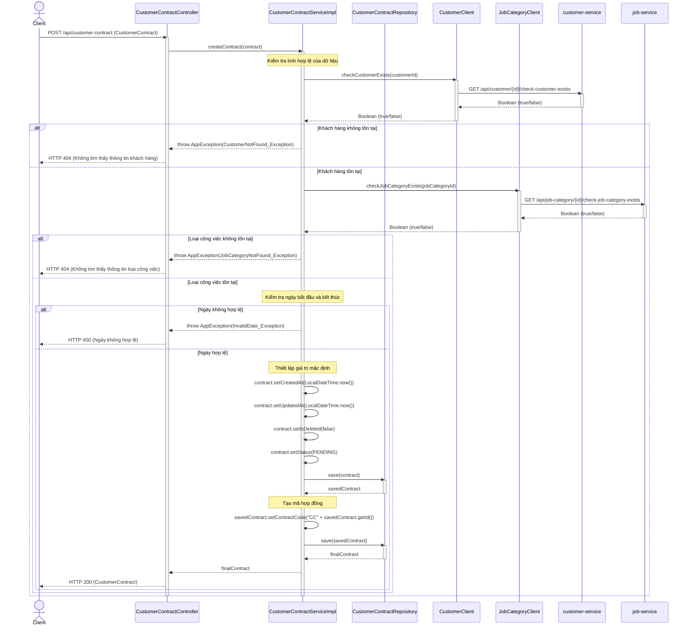
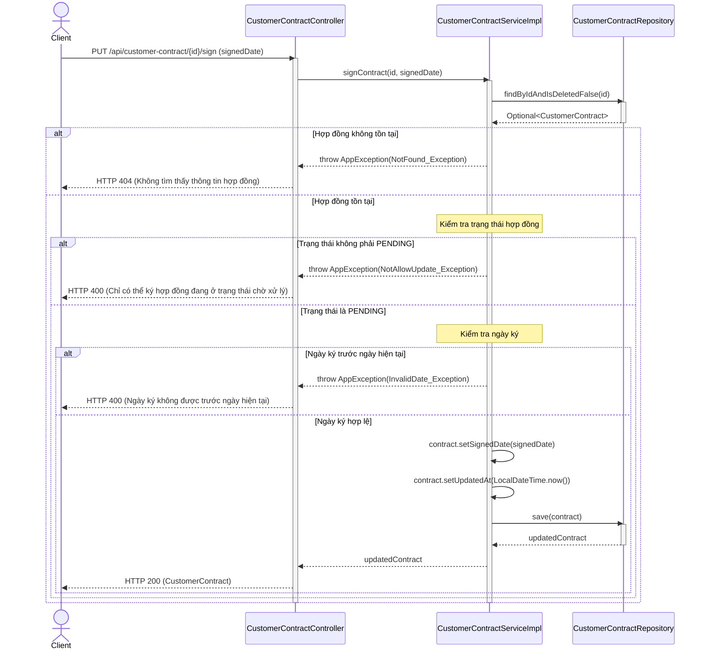
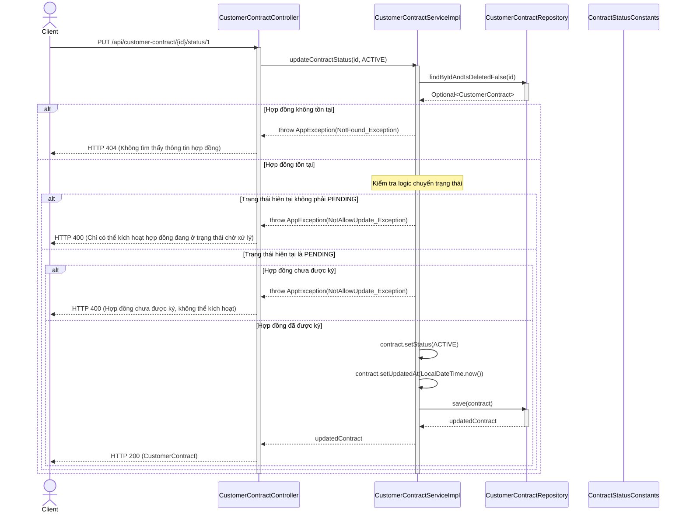
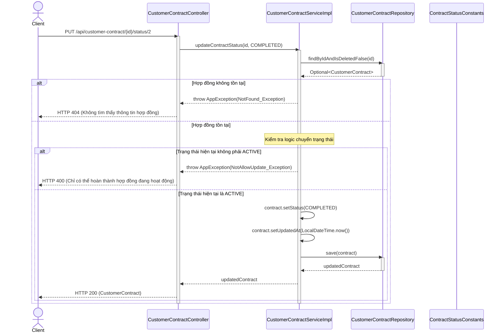
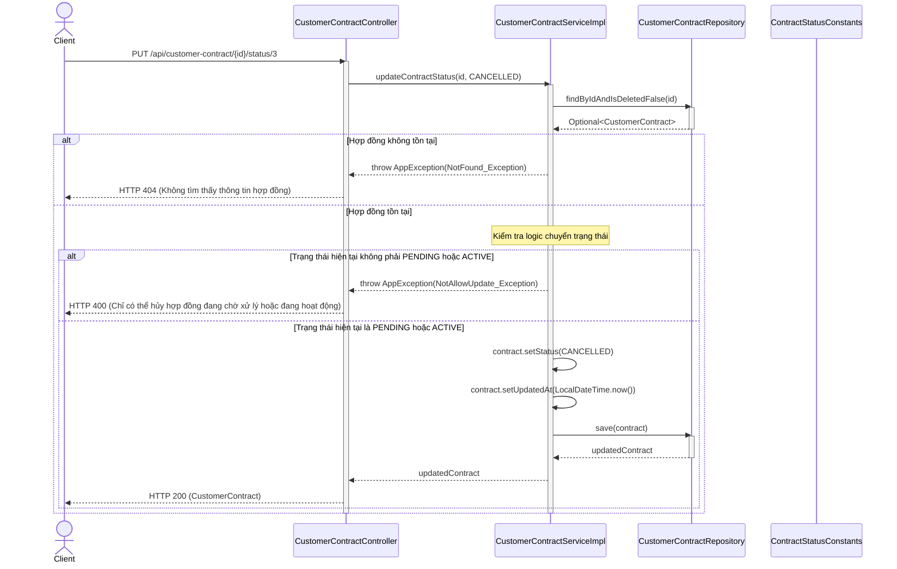

# Biểu đồ tuần tự hoạt động chi tiết cho module "Ký hợp đồng với khách thuê lao động"

## 1. Tổng quan

Biểu đồ tuần tự mô tả chi tiết các luồng hoạt động chính trong module "Ký hợp đồng với khách thuê lao động", bao gồm:
1. Tạo hợp đồng mới
2. Ký hợp đồng
3. Kích hoạt hợp đồng
4. Hoàn thành hợp đồng
5. Hủy hợp đồng

## 2. Biểu đồ tuần tự

### 2.1. Tạo hợp đồng mới

### 2.2. Ký hợp đồng

### 2.3. Kích hoạt hợp đồng

### 2.4. Hoàn thành hợp đồng

### 2.5. Hủy hợp đồng

## 3. Mô tả chi tiết các luồng hoạt động

### 3.1. Tạo hợp đồng mới

1. **Khởi tạo**:
   - Client gửi request POST đến `/api/customer-contract` với thông tin hợp đồng
   - CustomerContractController nhận request và gọi phương thức `createContract()` từ CustomerContractServiceImpl

2. **Kiểm tra tính hợp lệ**:
   - Kiểm tra customerId tồn tại thông qua CustomerClient
   - Kiểm tra jobCategoryId tồn tại thông qua JobCategoryClient
   - Kiểm tra ngày bắt đầu và kết thúc

3. **Xử lý dữ liệu**:
   - Thiết lập các giá trị mặc định: createdAt, updatedAt, isDeleted
   - Thiết lập trạng thái mặc định là PENDING
   - Lưu hợp đồng vào cơ sở dữ liệu
   - Tạo mã hợp đồng và lưu lại

4. **Kết quả**:
   - Trả về hợp đồng đã tạo cho Client

### 3.2. Ký hợp đồng

1. **Khởi tạo**:
   - Client gửi request PUT đến `/api/customer-contract/{id}/sign` với ngày ký
   - CustomerContractController nhận request và gọi phương thức `signContract()` từ CustomerContractServiceImpl

2. **Kiểm tra tính hợp lệ**:
   - Kiểm tra hợp đồng tồn tại
   - Kiểm tra trạng thái hợp đồng (phải là PENDING)
   - Kiểm tra ngày ký (không được trước ngày hiện tại)

3. **Xử lý dữ liệu**:
   - Cập nhật ngày ký và thời gian cập nhật
   - Lưu hợp đồng vào cơ sở dữ liệu

4. **Kết quả**:
   - Trả về hợp đồng đã cập nhật cho Client

### 3.3. Kích hoạt hợp đồng

1. **Khởi tạo**:
   - Client gửi request PUT đến `/api/customer-contract/{id}/status/1`
   - CustomerContractController nhận request và gọi phương thức `updateContractStatus()` từ CustomerContractServiceImpl

2. **Kiểm tra tính hợp lệ**:
   - Kiểm tra hợp đồng tồn tại
   - Kiểm tra trạng thái hiện tại (phải là PENDING)
   - Kiểm tra hợp đồng đã được ký chưa

3. **Xử lý dữ liệu**:
   - Cập nhật trạng thái thành ACTIVE và thời gian cập nhật
   - Lưu hợp đồng vào cơ sở dữ liệu

4. **Kết quả**:
   - Trả về hợp đồng đã cập nhật cho Client

### 3.4. Hoàn thành hợp đồng

1. **Khởi tạo**:
   - Client gửi request PUT đến `/api/customer-contract/{id}/status/2`
   - CustomerContractController nhận request và gọi phương thức `updateContractStatus()` từ CustomerContractServiceImpl

2. **Kiểm tra tính hợp lệ**:
   - Kiểm tra hợp đồng tồn tại
   - Kiểm tra trạng thái hiện tại (phải là ACTIVE)

3. **Xử lý dữ liệu**:
   - Cập nhật trạng thái thành COMPLETED và thời gian cập nhật
   - Lưu hợp đồng vào cơ sở dữ liệu

4. **Kết quả**:
   - Trả về hợp đồng đã cập nhật cho Client

### 3.5. Hủy hợp đồng

1. **Khởi tạo**:
   - Client gửi request PUT đến `/api/customer-contract/{id}/status/3`
   - CustomerContractController nhận request và gọi phương thức `updateContractStatus()` từ CustomerContractServiceImpl

2. **Kiểm tra tính hợp lệ**:
   - Kiểm tra hợp đồng tồn tại
   - Kiểm tra trạng thái hiện tại (phải là PENDING hoặc ACTIVE)

3. **Xử lý dữ liệu**:
   - Cập nhật trạng thái thành CANCELLED và thời gian cập nhật
   - Lưu hợp đồng vào cơ sở dữ liệu

4. **Kết quả**:
   - Trả về hợp đồng đã cập nhật cho Client

## 4. Kết luận

Biểu đồ tuần tự chi tiết cho module "Ký hợp đồng với khách thuê lao động" đã mô tả đầy đủ các luồng hoạt động chính, bao gồm tạo hợp đồng mới, ký hợp đồng, kích hoạt hợp đồng, hoàn thành hợp đồng và hủy hợp đồng. Mỗi luồng hoạt động đều được mô tả chi tiết từ khi Client gửi request đến khi nhận được response, bao gồm các bước kiểm tra tính hợp lệ, xử lý dữ liệu và lưu trữ.

Biểu đồ tuần tự này giúp hiểu rõ hơn về cách các đối tượng tương tác với nhau theo thời gian, cũng như các điều kiện và ràng buộc trong quá trình xử lý nghiệp vụ. Điều này rất hữu ích cho việc phát triển, kiểm thử và bảo trì hệ thống.
