# Sơ đồ tuần tự - Chức năng Ký hợp đồng với khách thuê lao động

## Tổng quan
Sơ đồ tuần tự này mô tả luồng xử lý chi tiết cho chức năng tạo hợp đồng thuê lao động trong hệ thống microservice, từ khi người dùng nhập thông tin đến khi hợp đồng được lưu thành công.

## Sơ đồ tuần tự Mermaid

```mermaid
sequenceDiagram
    participant User as 👤 Người dùng
    participant Frontend as 🖥️ React Frontend<br/>(CreateContractPage)
    participant Form as 📝 CustomerContractForm
    participant CustomerDialog as 👥 CustomerDialog
    participant JobForm as 🔧 JobDetailForm
    participant ContractService as 📞 ContractService<br/>(Frontend)
    participant ApiGateway as 🚪 API Gateway<br/>(Port 8080)
    participant ContractController as 🎯 CustomerContractController<br/>(Port 8083)
    participant ContractServiceImpl as ⚙️ CustomerContractServiceImpl
    participant CustomerClient as 👤 CustomerClient<br/>(Feign)
    participant JobCategoryClient as 🔧 JobCategoryClient<br/>(Feign)
    participant CustomerService as 👥 Customer Service<br/>(Port 8081)
    participant JobService as 🔧 Job Service<br/>(Port 8082)
    participant ContractRepo as 🗄️ CustomerContractRepository
    participant JobDetailRepo as 🗄️ JobDetailRepository
    participant WorkShiftRepo as 🗄️ WorkShiftRepository
    participant Database as 💾 PostgreSQL Database

    Note over User, Database: 🚀 BƯỚC 1: KHỞI TẠO FORM TẠO HỢP ĐỒNG

    User->>+Frontend: Truy cập trang tạo hợp đồng
    Frontend->>+Form: Render CustomerContractForm
    Form->>+JobForm: Load JobDetailForm components
    JobForm->>+ContractService: Gọi getAllJobCategories()
    ContractService->>+ApiGateway: GET /api/job-category
    ApiGateway->>+JobService: Route đến Job Service
    JobService-->>-ApiGateway: Trả về danh sách JobCategory
    ApiGateway-->>-ContractService: Response JobCategory[]
    ContractService-->>-JobForm: Danh sách loại công việc
    JobForm-->>-Form: Hiển thị dropdown loại công việc
    Form-->>-Frontend: Form sẵn sàng nhập liệu
    Frontend-->>-User: Hiển thị form trống

    Note over User, Database: 👥 BƯỚC 2: CHỌN KHÁCH HÀNG

    User->>+Frontend: Click "Chọn khách hàng"
    Frontend->>+Form: handleOpenCustomerDialog()
    Form->>+CustomerDialog: Mở dialog chọn khách hàng
    CustomerDialog->>+ContractService: Gọi getAllCustomers()
    ContractService->>+ApiGateway: GET /api/customer
    ApiGateway->>+CustomerService: Route đến Customer Service
    CustomerService-->>-ApiGateway: Trả về danh sách Customer
    ApiGateway-->>-ContractService: Response Customer[]
    ContractService-->>-CustomerDialog: Danh sách khách hàng
    CustomerDialog-->>-Form: Hiển thị danh sách khách hàng
    Form-->>-Frontend: Dialog hiển thị
    Frontend-->>-User: Hiển thị dialog chọn khách hàng

    User->>+CustomerDialog: Chọn khách hàng cụ thể
    CustomerDialog->>+Form: handleSelectCustomer(customer)
    Form->>+Frontend: onChange với customerId và customerName
    Frontend->>Frontend: Cập nhật state contract
    Frontend-->>-User: Hiển thị thông tin khách hàng đã chọn

    Note over User, Database: 📋 BƯỚC 3: NHẬP THÔNG TIN HỢP ĐỒNG

    User->>+Frontend: Nhập thông tin cơ bản (mô tả, địa chỉ)
    Frontend->>+Form: handleInputChange()
    Form->>+Frontend: onChange(updatedContract)
    Frontend->>Frontend: Cập nhật state contract
    Frontend-->>-User: Hiển thị thông tin đã nhập

    Note over User, Database: 🔧 BƯỚC 4: THÊM CHI TIẾT CÔNG VIỆC

    User->>+Frontend: Click "Thêm công việc"
    Frontend->>+Form: handleAddJobDetail()
    Form->>+JobForm: Thêm JobDetailForm mới
    JobForm-->>-Form: Component JobDetail mới
    Form-->>-Frontend: Hiển thị form chi tiết công việc
    Frontend-->>-User: Form chi tiết công việc trống

    User->>+JobForm: Chọn loại công việc
    JobForm->>+Form: handleJobDetailChange()
    Form->>+Frontend: onChange với jobDetail cập nhật
    Frontend->>Frontend: Cập nhật jobDetails trong contract
    Frontend-->>-User: Hiển thị loại công việc đã chọn

    User->>+JobForm: Nhập thông tin công việc (địa điểm, ngày)
    JobForm->>+Form: handleJobDetailChange()
    Form->>+Frontend: onChange với jobDetail cập nhật
    Frontend->>Frontend: Auto-calculate contract dates
    Frontend-->>-User: Hiển thị thông tin công việc

    Note over User, Database: ⏰ BƯỚC 5: THÊM CA LÀM VIỆC

    User->>+JobForm: Click "Thêm ca làm việc"
    JobForm->>JobForm: handleAddWorkShift()
    JobForm-->>-User: Hiển thị form ca làm việc mới

    User->>+JobForm: Nhập thông tin ca làm việc<br/>(giờ bắt đầu, kết thúc, số người, lương, ngày làm)
    JobForm->>+Form: handleJobDetailChange()
    Form->>+Frontend: onChange với workShift cập nhật
    Frontend->>Frontend: Auto-calculate totalAmount
    Frontend-->>-User: Hiển thị tổng tiền tự động tính

    Note over User, Database: ✅ BƯỚC 6: VALIDATION VÀ SUBMIT

    User->>+Frontend: Click "Tạo hợp đồng"
    Frontend->>+Form: handleFormSubmit()
    Form->>+Frontend: onSubmit()
    Frontend->>+Frontend: validateContract()
    
    alt Validation thất bại
        Frontend-->>User: Hiển thị lỗi validation
    else Validation thành công
        Frontend->>+ContractService: createContract(contract)
        
        Note over ContractService, Database: 🔄 BƯỚC 7: XỬ LÝ TẠO HỢP ĐỒNG

        ContractService->>+ApiGateway: POST /api/customer-contract
        ApiGateway->>+ContractController: Route đến Contract Service
        ContractController->>+ContractServiceImpl: createContract(contract)
        
        Note over ContractServiceImpl: 🔍 VALIDATION PHASE
        
        ContractServiceImpl->>ContractServiceImpl: Validate input parameters
        ContractServiceImpl->>+CustomerClient: checkCustomerExists(customerId)
        CustomerClient->>+CustomerService: GET /{id}/check-customer-exists
        CustomerService-->>-CustomerClient: Boolean response
        CustomerClient-->>-ContractServiceImpl: Customer exists confirmation
        
        ContractServiceImpl->>+JobCategoryClient: Validate job categories
        loop Cho mỗi JobDetail
            ContractServiceImpl->>+JobCategoryClient: checkJobCategoryExists(jobCategoryId)
            JobCategoryClient->>+JobService: GET /{id}/check-job-category-exists
            JobService-->>-JobCategoryClient: Boolean response
            JobCategoryClient-->>-ContractServiceImpl: JobCategory exists confirmation
        end
        
        ContractServiceImpl->>+ContractRepo: Check duplicate contracts
        ContractRepo->>+Database: findByCustomerIdAndStartingDateAndEndingDate
        Database-->>-ContractRepo: Existing contracts
        ContractRepo-->>-ContractServiceImpl: Duplicate check result
        
        Note over ContractServiceImpl: 💾 PERSISTENCE PHASE
        
        ContractServiceImpl->>ContractServiceImpl: Set default values (status=0, timestamps)
        ContractServiceImpl->>+ContractRepo: save(contract)
        ContractRepo->>+Database: INSERT customer_contracts
        Database-->>-ContractRepo: Contract saved with ID
        ContractRepo-->>-ContractServiceImpl: Saved CustomerContract
        
        loop Cho mỗi JobDetail
            ContractServiceImpl->>+JobDetailRepo: save(jobDetail)
            JobDetailRepo->>+Database: INSERT job_details
            Database-->>-JobDetailRepo: JobDetail saved
            JobDetailRepo-->>-ContractServiceImpl: Saved JobDetail
            
            loop Cho mỗi WorkShift
                ContractServiceImpl->>+WorkShiftRepo: save(workShift)
                WorkShiftRepo->>+Database: INSERT work_shifts
                Database-->>-WorkShiftRepo: WorkShift saved
                WorkShiftRepo-->>-ContractServiceImpl: Saved WorkShift
            end
        end
        
        ContractServiceImpl->>ContractServiceImpl: entityManager.flush()
        ContractServiceImpl-->>-ContractController: Saved CustomerContract
        ContractController-->>-ApiGateway: ResponseEntity<CustomerContract>
        ApiGateway-->>-ContractService: HTTP 200 + Contract data
        ContractService-->>-Frontend: Created contract
        
        Note over Frontend: 🎉 SUCCESS HANDLING
        
        Frontend->>Frontend: setCreatedContract(contract)
        Frontend->>Frontend: setSuccess("Tạo hợp đồng thành công!")
        Frontend->>Frontend: Start redirect countdown
        Frontend-->>-User: Hiển thị thông báo thành công + actions
    end

    Note over User, Database: 🔄 BƯỚC 8: POST-CREATION ACTIONS

    alt User chọn "Xem chi tiết"
        User->>+Frontend: Click "Xem chi tiết hợp đồng"
        Frontend->>Frontend: navigate(`/contracts/${contract.id}`)
        Frontend-->>-User: Chuyển đến trang chi tiết hợp đồng
    else User chọn "Xem danh sách"
        User->>+Frontend: Click "Xem danh sách hợp đồng"
        Frontend->>Frontend: navigate('/contracts')
        Frontend-->>-User: Chuyển đến trang danh sách hợp đồng
    else User chọn "Tạo mới"
        User->>+Frontend: Click "Tạo hợp đồng mới"
        Frontend->>Frontend: Reset form state
        Frontend-->>-User: Form tạo hợp đồng mới
    else Auto redirect (sau 5 giây)
        Frontend->>Frontend: Countdown timer expires
        Frontend->>Frontend: navigate(`/contracts/${contract.id}`)
        Frontend-->>-User: Tự động chuyển đến chi tiết hợp đồng
    end
```

## Mô tả chi tiết các bước

### 🚀 Bước 1: Khởi tạo Form
- User truy cập trang tạo hợp đồng
- Frontend load các component cần thiết
- JobDetailForm tự động fetch danh sách loại công việc từ Job Service
- Form hiển thị với Stepper workflow (3 bước)

### 👥 Bước 2: Chọn khách hàng  
- User mở dialog chọn khách hàng
- System fetch danh sách khách hàng từ Customer Service
- User chọn khách hàng cụ thể
- Form cập nhật thông tin khách hàng đã chọn

### 📋 Bước 3: Nhập thông tin hợp đồng
- User nhập mô tả và địa chỉ hợp đồng
- Form tự động cập nhật state theo real-time

### 🔧 Bước 4: Thêm chi tiết công việc
- User thêm các JobDetail với loại công việc
- Mỗi JobDetail có thể có nhiều WorkShift
- System tự động tính toán ngày bắt đầu/kết thúc hợp đồng

### ⏰ Bước 5: Thêm ca làm việc
- User định nghĩa các ca làm việc với thời gian cụ thể
- Nhập số lượng người lao động và mức lương
- Chọn các ngày trong tuần làm việc
- System tự động tính tổng tiền hợp đồng

### ✅ Bước 6: Validation và Submit
- Frontend validation toàn diện trước khi gửi
- Kiểm tra tính hợp lệ của tất cả dữ liệu đầu vào

### 🔄 Bước 7: Xử lý tạo hợp đồng (Backend)
**Validation Phase:**
- Kiểm tra customer tồn tại qua CustomerClient
- Kiểm tra job categories tồn tại qua JobCategoryClient  
- Kiểm tra duplicate contracts

**Persistence Phase:**
- Lưu CustomerContract với transaction
- Lưu các JobDetail liên quan
- Lưu các WorkShift cho mỗi JobDetail
- Flush entity manager để đảm bảo data consistency

### 🎉 Bước 8: Xử lý thành công
- Hiển thị thông báo thành công với thông tin hợp đồng
- Cung cấp các action: Xem chi tiết, Xem danh sách, Tạo mới
- Auto redirect sau 5 giây nếu user không chọn action

## Đặc điểm kỹ thuật

### 🔒 Transaction Management
- Sử dụng `@Transactional` với isolation SERIALIZABLE
- EntityManager flush để đảm bảo data persistence
- Rollback tự động khi có exception

### 🌐 Microservice Communication
- API Gateway làm single entry point (port 8080)
- Feign Client cho inter-service communication
- Circuit breaker pattern cho fault tolerance

### ⚡ Real-time Calculation
- Auto-calculate contract dates từ job details
- Auto-calculate total amount từ work shifts
- Real-time validation và feedback

### 🎯 Error Handling
- Frontend validation trước khi submit
- Backend validation với custom exceptions
- User-friendly error messages bằng tiếng Việt
