# Sơ đồ lớp chi tiết cho module "Ký hợp đồng với khách thuê lao động"

Sơ đồ lớp dưới đây mô tả chi tiết các lớp và mối quan hệ giữa chúng trong module "Ký hợp đồng với khách thuê lao động" theo kiến trúc vi dịch vụ (microservices). Mỗi microservice được thể hiện như một package riêng biệt.

## Các microservice tham gia

1. **customer-service**: Quản lý thông tin khách hàng
2. **job-service**: Quản lý thông tin loại công việc (đầu việc)
3. **customer-contract-service**: Quản lý hợp đồng với khách hàng
4. **frontend**: Giao diện người dùng

## Sơ đồ lớp

```mermaid
classDiagram
    %% Microservice packages
    namespace customer-service {
        class CustomerController
        class CustomerService
        class CustomerServiceImpl
        class Customer
        class CustomerRepository
    }

    namespace customer-contract-service {
        class CustomerContractController
        class CustomerContractService
        class CustomerContractServiceImpl
        class CustomerContract
        class CustomerContractRepository
        class CustomerClient
        class JobCategoryClient
        class Customer
        class JobCategory
    }

    namespace job-service {
        class JobCategoryController
        class JobCategoryService
        class JobCategoryServiceImpl
        class JobCategory
        class JobCategoryRepository
    }

    namespace frontend {
        class CustomerContractList
        class CustomerSelectionDialog
        class CustomerAddDialog
        class ContractForm
        class ContractDetail
    }

    %% Customer Service
    class Customer {
        +Long id
        +String fullName
        +String companyName
        +String phoneNumber
        +String email
        +String address
        +Boolean isDeleted
        +LocalDateTime createdAt
        +LocalDateTime updatedAt
    }

    class CustomerController {
        +ResponseEntity<Customer> getCustomerById(Long id)
        +ResponseEntity<Customer> createCustomer(Customer customer)
        +ResponseEntity<List<Customer>> getAllCustomers()
        +ResponseEntity<Customer> updateCustomer(Customer customer)
        +ResponseEntity<Void> deleteCustomer(Long id)
        +ResponseEntity<Boolean> checkCustomerExists(Long id)
        +ResponseEntity<List<Customer>> searchCustomers(String fullName, String phoneNumber)
    }

    class CustomerService {
        <<interface>>
        +Customer getCustomerById(Long id)
        +Customer createCustomer(Customer customer)
        +List<Customer> getAllCustomers()
        +Customer updateCustomer(Customer customer)
        +void deleteCustomer(Long id)
        +boolean checkCustomerExists(Long id)
        +List<Customer> searchCustomers(String fullName, String phoneNumber)
    }

    class CustomerServiceImpl {
        +Customer getCustomerById(Long id)
        +Customer createCustomer(Customer customer)
        +List<Customer> getAllCustomers()
        +Customer updateCustomer(Customer customer)
        +void deleteCustomer(Long id)
        +boolean checkCustomerExists(Long id)
        +List<Customer> searchCustomers(String fullName, String phoneNumber)
    }

    class CustomerRepository {
        <<interface>>
        +Optional<Customer> findByIdAndIsDeletedFalse(Long id)
        +List<Customer> findByIsDeletedFalse()
        +List<Customer> findByFullNameContainingAndIsDeletedFalse(String fullName)
        +List<Customer> findByPhoneNumberContainingAndIsDeletedFalse(String phoneNumber)
    }

    %% Customer Contract Service
    class CustomerContract {
        +Long id
        +String contractCode
        +LocalDate startingDate
        +LocalDate endingDate
        +LocalDate signedDate
        +Integer numberOfWorkers
        +Double totalAmount
        +String address
        +String description
        +Long jobCategoryId
        +Long customerId
        +Integer status
        +Boolean isDeleted
        +LocalDateTime createdAt
        +LocalDateTime updatedAt
    }

    class CustomerContractController {
        +ResponseEntity<CustomerContract> getContractById(Long id)
        +ResponseEntity<CustomerContract> createContract(CustomerContract contract)
        +ResponseEntity<List<CustomerContract>> getAllContracts()
        +ResponseEntity<CustomerContract> updateContract(CustomerContract contract)
        +ResponseEntity<Void> deleteContract(Long id)
        +ResponseEntity<List<CustomerContract>> getContractsByCustomerId(Long customerId)
        +ResponseEntity<List<CustomerContract>> getContractsByStatus(Integer status)
        +ResponseEntity<List<CustomerContract>> getContractsByJobCategoryId(Long jobCategoryId)
        +ResponseEntity<List<CustomerContract>> getContractsByDateRange(LocalDate startDate, LocalDate endDate)
        +ResponseEntity<CustomerContract> updateContractStatus(Long id, Integer status)
        +ResponseEntity<CustomerContract> signContract(Long id, LocalDate signedDate)
        +ResponseEntity<Boolean> checkContractExists(Long id)
    }

    class CustomerContractService {
        <<interface>>
        +CustomerContract getContractById(Long id)
        +CustomerContract createContract(CustomerContract contract)
        +List<CustomerContract> getAllContracts()
        +CustomerContract updateContract(CustomerContract contract)
        +void deleteContract(Long id)
        +List<CustomerContract> getContractsByCustomerId(Long customerId)
        +List<CustomerContract> getContractsByStatus(Integer status)
        +List<CustomerContract> getContractsByJobCategoryId(Long jobCategoryId)
        +List<CustomerContract> getContractsByDateRange(LocalDate startDate, LocalDate endDate)
        +CustomerContract updateContractStatus(Long id, Integer status)
        +CustomerContract signContract(Long id, LocalDate signedDate)
        +boolean checkContractExists(Long id)
    }

    class CustomerContractServiceImpl {
        +CustomerContract getContractById(Long id)
        +CustomerContract createContract(CustomerContract contract)
        +List<CustomerContract> getAllContracts()
        +CustomerContract updateContract(CustomerContract contract)
        +void deleteContract(Long id)
        +List<CustomerContract> getContractsByCustomerId(Long customerId)
        +List<CustomerContract> getContractsByStatus(Integer status)
        +List<CustomerContract> getContractsByJobCategoryId(Long jobCategoryId)
        +List<CustomerContract> getContractsByDateRange(LocalDate startDate, LocalDate endDate)
        +CustomerContract updateContractStatus(Long id, Integer status)
        +CustomerContract signContract(Long id, LocalDate signedDate)
        +boolean checkContractExists(Long id)
    }

    class CustomerContractRepository {
        <<interface>>
        +Optional<CustomerContract> findByIdAndIsDeletedFalse(Long id)
        +List<CustomerContract> findByIsDeletedFalse()
        +List<CustomerContract> findByCustomerIdAndIsDeletedFalse(Long customerId)
        +List<CustomerContract> findByStatusAndIsDeletedFalse(Integer status)
        +List<CustomerContract> findByJobCategoryIdAndIsDeletedFalse(Long jobCategoryId)
        +List<CustomerContract> findByStartingDateBetweenAndIsDeletedFalse(LocalDate startDate, LocalDate endDate)
    }

    class CustomerClient {
        <<interface>>
        +Customer getCustomerById(Long id)
        +Boolean checkCustomerExists(Long id)
        +List<Customer> searchCustomers(String fullName, String phoneNumber)
    }

    class JobCategoryClient {
        <<interface>>
        +JobCategory getJobCategoryById(Long id)
        +Boolean checkJobCategoryExists(Long id)
        +List<JobCategory> getAllJobCategories()
    }

    %% Job Service
    class JobCategory {
        +Long id
        +String name
        +String description
        +Boolean isDeleted
        +LocalDateTime createdAt
        +LocalDateTime updatedAt
    }

    class JobCategoryController {
        +ResponseEntity<JobCategory> getJobCategoryById(Long id)
        +ResponseEntity<JobCategory> createJobCategory(JobCategory jobCategory)
        +ResponseEntity<List<JobCategory>> getAllJobCategories()
        +ResponseEntity<JobCategory> updateJobCategory(JobCategory jobCategory)
        +ResponseEntity<Void> deleteJobCategory(Long id)
        +ResponseEntity<Boolean> checkJobCategoryExists(Long id)
    }

    class JobCategoryService {
        <<interface>>
        +JobCategory getJobCategoryById(Long id)
        +JobCategory createJobCategory(JobCategory jobCategory)
        +List<JobCategory> getAllJobCategories()
        +JobCategory updateJobCategory(JobCategory jobCategory)
        +void deleteJobCategory(Long id)
        +boolean checkJobCategoryExists(Long id)
    }

    class JobCategoryServiceImpl {
        +JobCategory getJobCategoryById(Long id)
        +JobCategory createJobCategory(JobCategory jobCategory)
        +List<JobCategory> getAllJobCategories()
        +JobCategory updateJobCategory(JobCategory jobCategory)
        +void deleteJobCategory(Long id)
        +boolean checkJobCategoryExists(Long id)
    }

    class JobCategoryRepository {
        <<interface>>
        +Optional<JobCategory> findByIdAndIsDeletedFalse(Long id)
        +List<JobCategory> findByIsDeletedFalse()
    }

    %% Frontend Components
    class CustomerContractList {
        -List<CustomerContract> contracts
        -List<Customer> customers
        -List<JobCategory> jobCategories
        -CustomerContract selectedContract
        -Customer selectedCustomer
        -boolean isEdit
        +fetchContracts()
        +fetchCustomers()
        +fetchJobCategories()
        +openNewDialog()
        +openEditDialog(contract)
        +deleteContract(id)
        +saveContract()
        +openCustomerSelectionDialog()
        +handleSelectCustomer(customer)
        +handleAddCustomerSuccess(newCustomer)
    }

    class CustomerSelectionDialog {
        -List<Customer> customers
        -String searchTerm
        +searchCustomers()
        +selectCustomer(customer)
        +openAddNewCustomer()
    }

    class CustomerAddDialog {
        -Customer customer
        +saveCustomer()
    }

    class ContractForm {
        -CustomerContract contract
        -List<Customer> customers
        -List<JobCategory> jobCategories
        -boolean isEdit
        +handleSave()
        +getSelectedCustomer()
        +getSelectedJobCategory()
    }

    class ContractDetail {
        -CustomerContract contract
        -List<Customer> customers
        -List<JobCategory> jobCategories
        +getSelectedCustomer()
        +getSelectedJobCategory()
        +formatDate(date)
        +formatCurrency(value)
        +getStatusLabel(status)
        +getStatusClass(status)
    }

    %% Relationships

    %% Customer Service Relationships
    CustomerController --> CustomerService
    CustomerService <|.. CustomerServiceImpl
    CustomerServiceImpl --> CustomerRepository
    CustomerRepository --> Customer

    %% Customer Contract Service Relationships
    CustomerContractController --> CustomerContractService
    CustomerContractService <|.. CustomerContractServiceImpl
    CustomerContractServiceImpl --> CustomerContractRepository
    CustomerContractServiceImpl --> CustomerClient
    CustomerContractServiceImpl --> JobCategoryClient
    CustomerContractRepository --> CustomerContract
    CustomerClient ..> CustomerController : "HTTP"
    JobCategoryClient ..> JobCategoryController : "HTTP"

    %% Job Service Relationships
    JobCategoryController --> JobCategoryService
    JobCategoryService <|.. JobCategoryServiceImpl
    JobCategoryServiceImpl --> JobCategoryRepository
    JobCategoryRepository --> JobCategory

    %% Frontend Relationships
    CustomerContractList --> ContractForm
    CustomerContractList --> ContractDetail
    CustomerContractList --> CustomerSelectionDialog
    CustomerSelectionDialog --> CustomerAddDialog
    CustomerContractList ..> CustomerContractController : "HTTP"
    CustomerSelectionDialog ..> CustomerController : "HTTP"
    CustomerAddDialog ..> CustomerController : "HTTP"
    ContractForm ..> JobCategoryController : "HTTP"
```

## Giải thích chi tiết các thành phần trong sơ đồ

### 1. customer-service

#### Entities
- **Customer**: Entity chứa thông tin khách hàng với các thuộc tính như id, fullName, companyName, phoneNumber, email, address, isDeleted, createdAt, updatedAt.

#### Controllers
- **CustomerController**: REST API controller xử lý các request liên quan đến khách hàng, cung cấp các endpoint như getCustomerById, createCustomer, getAllCustomers, updateCustomer, deleteCustomer, checkCustomerExists, searchCustomers.

#### Services
- **CustomerService**: Interface định nghĩa các phương thức dịch vụ cho khách hàng.
- **CustomerServiceImpl**: Lớp triển khai (implements) của CustomerService, chứa logic nghiệp vụ cho khách hàng.

#### Repositories
- **CustomerRepository**: Interface truy cập dữ liệu khách hàng, cung cấp các phương thức như findByIdAndIsDeletedFalse, findByIsDeletedFalse, findByFullNameContainingAndIsDeletedFalse, findByPhoneNumberContainingAndIsDeletedFalse.

### 2. job-service

#### Entities
- **JobCategory**: Entity chứa thông tin loại công việc với các thuộc tính như id, name, description, isDeleted, createdAt, updatedAt.

#### Controllers
- **JobCategoryController**: REST API controller xử lý các request liên quan đến loại công việc, cung cấp các endpoint như getJobCategoryById, createJobCategory, getAllJobCategories, updateJobCategory, deleteJobCategory, checkJobCategoryExists.

#### Services
- **JobCategoryService**: Interface định nghĩa các phương thức dịch vụ cho loại công việc.
- **JobCategoryServiceImpl**: Lớp triển khai (implements) của JobCategoryService, chứa logic nghiệp vụ cho loại công việc.

#### Repositories
- **JobCategoryRepository**: Interface truy cập dữ liệu loại công việc, cung cấp các phương thức như findByIdAndIsDeletedFalse, findByIsDeletedFalse.

### 3. customer-contract-service

#### Entities
- **CustomerContract**: Entity chứa thông tin hợp đồng với các thuộc tính như id, contractCode, startingDate, endingDate, signedDate, numberOfWorkers, totalAmount, address, description, jobCategoryId, customerId, status, isDeleted, createdAt, updatedAt.

#### Controllers
- **CustomerContractController**: REST API controller xử lý các request liên quan đến hợp đồng, cung cấp các endpoint như getContractById, createContract, getAllContracts, updateContract, deleteContract, getContractsByCustomerId, getContractsByStatus, getContractsByJobCategoryId, getContractsByDateRange, updateContractStatus, signContract, checkContractExists.

#### Services
- **CustomerContractService**: Interface định nghĩa các phương thức dịch vụ cho hợp đồng.
- **CustomerContractServiceImpl**: Lớp triển khai (implements) của CustomerContractService, chứa logic nghiệp vụ cho hợp đồng.

#### Repositories
- **CustomerContractRepository**: Interface truy cập dữ liệu hợp đồng, cung cấp các phương thức như findByIdAndIsDeletedFalse, findByIsDeletedFalse, findByCustomerIdAndIsDeletedFalse, findByStatusAndIsDeletedFalse, findByJobCategoryIdAndIsDeletedFalse, findByStartingDateBetweenAndIsDeletedFalse.

#### Clients
- **CustomerClient**: Feign client gọi đến customer-service, cung cấp các phương thức như getCustomerById, checkCustomerExists, searchCustomers.
- **JobCategoryClient**: Feign client gọi đến job-service, cung cấp các phương thức như getJobCategoryById, checkJobCategoryExists, getAllJobCategories.

### 4. frontend

#### Components
- **CustomerContractList**: Component hiển thị danh sách hợp đồng và xử lý các thao tác CRUD.
- **CustomerSelectionDialog**: Dialog tìm kiếm và chọn khách hàng.
- **CustomerAddDialog**: Dialog thêm khách hàng mới.
- **ContractForm**: Form nhập thông tin hợp đồng.
- **ContractDetail**: Component hiển thị chi tiết hợp đồng.

## Mối quan hệ giữa các lớp

### Trong customer-service
- **CustomerController** sử dụng **CustomerService** (interface) để xử lý logic nghiệp vụ.
- **CustomerServiceImpl** triển khai (implements) **CustomerService** interface.
- **CustomerServiceImpl** sử dụng **CustomerRepository** để truy cập dữ liệu.
- **CustomerRepository** thao tác với entity **Customer**.

### Trong job-service
- **JobCategoryController** sử dụng **JobCategoryService** (interface) để xử lý logic nghiệp vụ.
- **JobCategoryServiceImpl** triển khai (implements) **JobCategoryService** interface.
- **JobCategoryServiceImpl** sử dụng **JobCategoryRepository** để truy cập dữ liệu.
- **JobCategoryRepository** thao tác với entity **JobCategory**.

### Trong customer-contract-service
- **CustomerContractController** sử dụng **CustomerContractService** (interface) để xử lý logic nghiệp vụ.
- **CustomerContractServiceImpl** triển khai (implements) **CustomerContractService** interface.
- **CustomerContractServiceImpl** sử dụng **CustomerContractRepository** để truy cập dữ liệu.
- **CustomerContractServiceImpl** sử dụng **CustomerClient** và **JobCategoryClient** để giao tiếp với các microservice khác.
- **CustomerContractRepository** thao tác với entity **CustomerContract**.
- **CustomerClient** gọi đến **CustomerController** thông qua HTTP.
- **JobCategoryClient** gọi đến **JobCategoryController** thông qua HTTP.

### Giữa frontend và backend
- **CustomerContractList** gọi đến **CustomerContractController** thông qua HTTP.
- **CustomerSelectionDialog** gọi đến **CustomerController** thông qua HTTP.
- **CustomerAddDialog** gọi đến **CustomerController** thông qua HTTP.
- **ContractForm** gọi đến **JobCategoryController** thông qua HTTP.

## Lưu ý về kiến trúc vi dịch vụ

Trong kiến trúc vi dịch vụ, mỗi microservice hoạt động độc lập và giao tiếp với nhau thông qua HTTP API. Các microservice không truy cập trực tiếp vào cơ sở dữ liệu của nhau, mà thông qua các client (như Feign client) để gọi API của microservice khác.

Mỗi microservice có cơ sở dữ liệu riêng và chỉ quản lý các entity thuộc về domain của mình. Ví dụ, customer-service quản lý entity Customer, job-service quản lý entity JobCategory, và customer-contract-service quản lý entity CustomerContract.

Trong sơ đồ lớp này, các mối quan hệ giữa các entity được thể hiện thông qua các trường khóa ngoại (như customerId, jobCategoryId) thay vì các mối quan hệ trực tiếp, phù hợp với nguyên tắc của kiến trúc vi dịch vụ.
