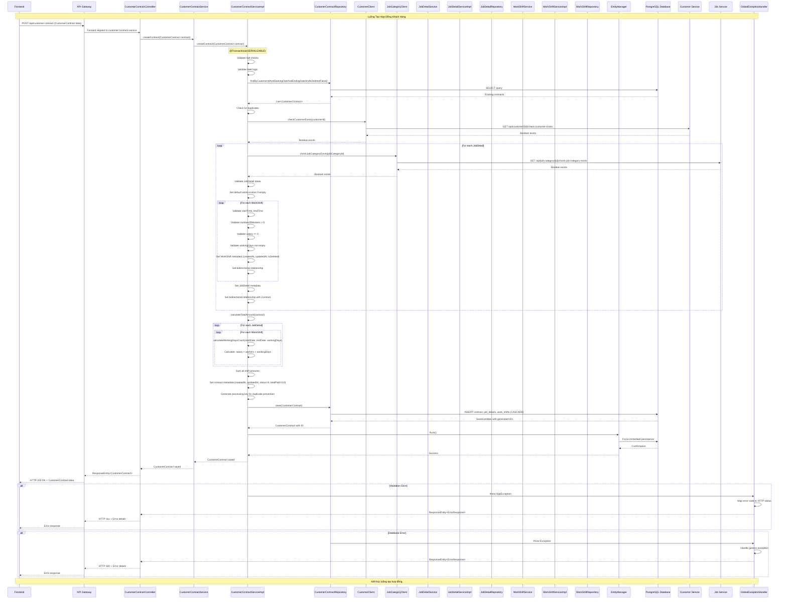

# Sơ Đồ Tuần Tự - Tạo Hợp Đồng Khách Hàng

## Mô tả
Sơ đồ tuần tự chi tiết mô tả luồng hoạt động khi tạo hợp đồng khách hàng trong customer-contract-service, bao gồm tất cả các lớp, service, repository và microservice liên quan.

## Sơ Đồ Tuần Tự

## Giải thích các bước chính

### 1. Request Processing (Bước 1-2)
- Frontend gửi POST request qua API Gateway
- Request được route đến CustomerContractController
- Controller delegate đến Service layer

### 2. Validation Phase (Bước 3-8)
- **Validation cơ bản**: Null checks, date logic validation
- **Duplicate check**: Kiểm tra hợp đồng trùng lặp trong database
- **Microservice validation**: Validate customer và job category qua Feign clients
- **Detail validation**: Validate từng JobDetail và WorkShift

### 3. Business Logic (Bước 9-10)
- **Tính toán tổng tiền**: Dựa trên công thức salary × workers × working days
- **Metadata setup**: Thiết lập các thông tin audit và trạng thái

### 4. Persistence (Bước 11-12)
- **Database save**: Lưu hợp đồng với cascade cho JobDetail và WorkShift
- **Force flush**: Đảm bảo dữ liệu được persist ngay lập tức

### 5. Response (Bước 13)
- Trả về CustomerContract đã được lưu với ID
- Response được truyền ngược lại Frontend

### 6. Error Handling
- **Validation errors**: AppException được map sang HTTP 4xx
- **System errors**: Generic Exception được map sang HTTP 500

## Các lớp tham gia

### Core Components
- **CustomerContractController**: REST endpoint handler
- **CustomerContractServiceImpl**: Business logic implementation
- **CustomerContractRepository**: Data access layer

### Supporting Services
- **JobDetailService/Impl**: Quản lý chi tiết công việc
- **WorkShiftService/Impl**: Quản lý ca làm việc
- **JobDetailRepository/WorkShiftRepository**: Data access cho entities con

### External Integration
- **CustomerClient**: Feign client gọi customer-service
- **JobCategoryClient**: Feign client gọi job-service
- **Customer Service**: External microservice (port 8081)
- **Job Service**: External microservice (port 8082)

### Infrastructure
- **EntityManager**: JPA persistence context management
- **GlobalExceptionHandler**: Centralized error handling
- **PostgreSQL Database**: Data storage layer
