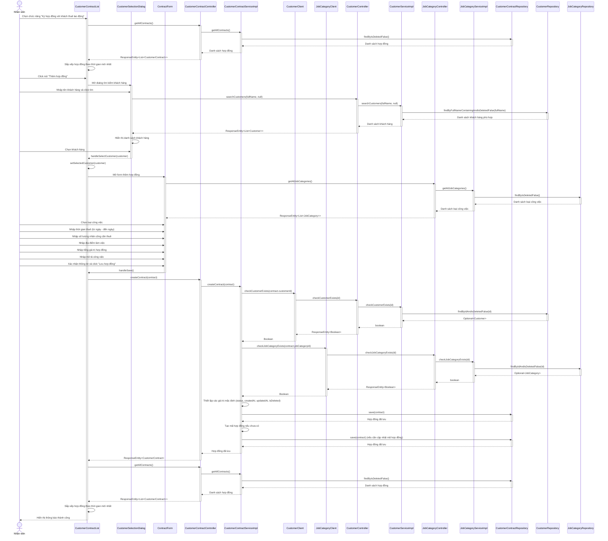

# Sơ đồ tuần tự cho module "Ký hợp đồng với khách thuê lao động"

Sơ đồ tuần tự dưới đây mô tả chi tiết luồng hoạt động của module "Ký hợp đồng với khách thuê lao động" theo các bước:

1. Nhân viên chọn chức năng "Ký hợp đồng với khách thuê lao động"
2. Giao diện danh sách các hợp đồng đã ký hiện lên, mặc định sắp xếp theo thứ tự thời gian mới nhất đến cũ nhất
3. Nhân viên click nút "Thêm hợp đồng" để tạo hợp đồng mới
4. Giao diện tìm khách hàng hiện lên
5. Nhân viên nhập tên khách hàng hoặc một phần tên khách hàng và click tìm
6. Giao diện hiện lên danh sách các khách hàng có tên chứa từ khóa vừa nhập
7. Nhân viên chọn đúng khách hàng
8. Nhân viên chọn đầu việc có trong danh sách, nhập thông tin hợp đồng: thời gian thuê (từ ngày - đến ngày), số lượng nhân công cần thuê,...
9. Nhân viên xác nhận lại toàn bộ thông tin với khách hàng và click lưu
10. Hệ thống lưu lại hợp đồng, báo thành công và đưa hợp đồng vào danh sách hợp đồng đã ký

## Giải thích chi tiết các bước trong sơ đồ

### 1. Mở danh sách hợp đồng
- Nhân viên chọn chức năng "Ký hợp đồng với khách thuê lao động"
- CustomerContractList gọi API getAllContracts() của CustomerContractController
- CustomerContractController gọi CustomerContractService để lấy danh sách hợp đồng
- CustomerContractService truy vấn dữ liệu từ CustomerContractRepository
- Danh sách hợp đồng được trả về và hiển thị, sắp xếp theo thời gian mới nhất

### 2. Tìm kiếm khách hàng
- Nhân viên click nút "Thêm hợp đồng" để mở CustomerSelectionDialog
- Nhân viên nhập tên khách hàng và tìm kiếm
- CustomerSelectionDialog gọi API searchCustomers() của CustomerController
- CustomerController gọi CustomerService để tìm kiếm khách hàng
- CustomerService truy vấn dữ liệu từ CustomerRepository
- Danh sách khách hàng phù hợp được trả về và hiển thị

### 3. Chọn khách hàng
- Nhân viên chọn khách hàng từ danh sách
- CustomerSelectionDialog gọi handleSelectCustomer() của CustomerContractList
- CustomerContractList lưu thông tin khách hàng đã chọn

### 4. Nhập thông tin hợp đồng
- ContractForm được mở để nhập thông tin hợp đồng
- ContractForm gọi API getAllJobCategories() của JobCategoryController để lấy danh sách loại công việc
- Nhân viên nhập các thông tin hợp đồng: loại công việc, thời gian thuê, số lượng nhân công, địa điểm làm việc, tổng giá trị, mô tả

### 5. Lưu hợp đồng
- Nhân viên xác nhận thông tin và click "Lưu hợp đồng"
- ContractForm gọi handleSave() của CustomerContractList
- CustomerContractList gọi API createContract() của CustomerContractController
- CustomerContractController gọi CustomerContractService để tạo hợp đồng mới
- CustomerContractService kiểm tra thông tin khách hàng và loại công việc thông qua CustomerClient và JobCategoryClient
- CustomerContractService thiết lập các giá trị mặc định và lưu hợp đồng vào CustomerContractRepository
- Hợp đồng mới được trả về và thêm vào danh sách
- Danh sách hợp đồng được cập nhật và hiển thị thông báo thành công

## Các thành phần tham gia

### Frontend
- **CustomerContractList**: Component hiển thị danh sách hợp đồng và xử lý các thao tác CRUD
- **CustomerSelectionDialog**: Dialog tìm kiếm và chọn khách hàng
- **ContractForm**: Form nhập thông tin hợp đồng

### Backend
- **CustomerContractController**: REST API controller xử lý các request liên quan đến hợp đồng
- **CustomerContractServiceImpl**: Triển khai logic nghiệp vụ cho hợp đồng
- **CustomerController**: REST API controller xử lý các request liên quan đến khách hàng
- **CustomerServiceImpl**: Triển khai logic nghiệp vụ cho khách hàng
- **JobCategoryController**: REST API controller xử lý các request liên quan đến loại công việc
- **JobCategoryServiceImpl**: Triển khai logic nghiệp vụ cho loại công việc
- **CustomerContractRepository**: Interface truy cập dữ liệu hợp đồng
- **CustomerRepository**: Interface truy cập dữ liệu khách hàng
- **JobCategoryRepository**: Interface truy cập dữ liệu loại công việc
- **CustomerClient**: Feign client gọi đến customer-service
- **JobCategoryClient**: Feign client gọi đến job-service
