# Sơ đồ tuần tự cho module "Ký hợp đồng với khách thuê lao động"

Sơ đồ tuần tự dưới đây mô tả chi tiết luồng hoạt động của module "Ký hợp đồng với khách thuê lao động" trong kiến trúc vi dịch vụ (microservices), tập trung vào backend và chỉ rõ các lớp thuộc về từng microservice.

## Các thành phần tham gia

1. **Frontend**: Giao diện người dùng
2. **api-gateway**: Cổng vào cho tất cả các request từ frontend đến các microservice
3. **customer-service**: Quản lý thông tin khách hàng
4. **job-service**: Quản lý thông tin loại công việc (đầu việc)
5. **customer-contract-service**: Quản lý hợp đồng với khách hàng

## Sơ đồ tuần tự

```mermaid
sequenceDiagram
    actor Staff as Nhân viên

    box Frontend
        participant Frontend
    end

    box api-gateway
        participant ApiGateway
    end

    box customer-contract-service
        participant ContractController as CustomerContractController
        participant ContractService as CustomerContractService
        participant ContractServiceImpl as CustomerContractServiceImpl
        participant ContractRepo as CustomerContractRepository
        participant CustomerClient
        participant JobClient as JobCategoryClient
        participant ContractModel as CustomerContract
    end

    box customer-service
        participant CustomerController
        participant CustomerService
        participant CustomerServiceImpl
        participant CustomerRepo as CustomerRepository
        participant CustomerModel as Customer
    end

    box job-service
        participant JobController as JobCategoryController
        participant JobService as JobCategoryService
        participant JobServiceImpl as JobCategoryServiceImpl
        participant JobRepo as JobCategoryRepository
        participant JobModel as JobCategory
    end

    %% 1. Nhân viên chọn chức năng "Ký hợp đồng với khách thuê lao động"
    Staff->>Frontend: Chọn chức năng "Ký hợp đồng với khách thuê lao động"
    activate Frontend

    %% 2. Giao diện danh sách các hợp đồng đã ký hiện lên
    Frontend->>ApiGateway: GET /api/customer-contract
    activate ApiGateway

    ApiGateway->>ContractController: GET /api/customer-contract
    activate ContractController

    ContractController->>ContractService: getAllContracts()
    activate ContractService

    ContractService->>ContractServiceImpl: getAllContracts()
    activate ContractServiceImpl

    ContractServiceImpl->>ContractRepo: findByIsDeletedFalse()
    activate ContractRepo
    ContractRepo->>ContractModel: Truy vấn dữ liệu
    activate ContractModel
    ContractModel-->>ContractRepo: Dữ liệu hợp đồng
    deactivate ContractModel
    ContractRepo-->>ContractServiceImpl: List<CustomerContract>
    deactivate ContractRepo

    ContractServiceImpl-->>ContractService: List<CustomerContract>
    deactivate ContractServiceImpl

    ContractService-->>ContractController: List<CustomerContract>
    deactivate ContractService

    ContractController-->>ApiGateway: ResponseEntity<List<CustomerContract>>
    deactivate ContractController

    ApiGateway-->>Frontend: ResponseEntity<List<CustomerContract>>
    deactivate ApiGateway

    Frontend->>Frontend: Sắp xếp hợp đồng theo thời gian mới nhất

    %% 3. Nhân viên click nút "Thêm hợp đồng" để tạo hợp đồng mới
    Staff->>Frontend: Click nút "Thêm hợp đồng"

    %% 4-5. Giao diện tìm khách hàng hiện lên và nhân viên nhập tên khách hàng
    Staff->>Frontend: Nhập tên khách hàng và click tìm

    %% 6. Giao diện hiện lên danh sách các khách hàng có tên chứa từ khóa vừa nhập
    Frontend->>ApiGateway: GET /api/customer/search?fullName={keyword}
    activate ApiGateway

    ApiGateway->>CustomerController: GET /api/customer/search?fullName={keyword}
    activate CustomerController

    CustomerController->>CustomerService: searchCustomers(fullName, null)
    activate CustomerService

    CustomerService->>CustomerServiceImpl: searchCustomers(fullName, null)
    activate CustomerServiceImpl

    CustomerServiceImpl->>CustomerRepo: findByFullNameContainingAndIsDeletedFalse(fullName)
    activate CustomerRepo
    CustomerRepo->>CustomerModel: Truy vấn dữ liệu
    activate CustomerModel
    CustomerModel-->>CustomerRepo: Dữ liệu khách hàng
    deactivate CustomerModel
    CustomerRepo-->>CustomerServiceImpl: List<Customer>
    deactivate CustomerRepo

    CustomerServiceImpl-->>CustomerService: List<Customer>
    deactivate CustomerServiceImpl

    CustomerService-->>CustomerController: List<Customer>
    deactivate CustomerService

    CustomerController-->>ApiGateway: ResponseEntity<List<Customer>>
    deactivate CustomerController

    ApiGateway-->>Frontend: ResponseEntity<List<Customer>>
    deactivate ApiGateway

    Frontend->>Frontend: Hiển thị danh sách khách hàng

    %% 7. Nhân viên chọn đúng khách hàng
    Staff->>Frontend: Chọn khách hàng

    %% 8. Nhân viên chọn đầu việc và nhập thông tin hợp đồng
    %% Lấy danh sách loại công việc (đầu việc)
    Frontend->>ApiGateway: GET /api/job-category
    activate ApiGateway

    ApiGateway->>JobController: GET /api/job-category
    activate JobController

    JobController->>JobService: getAllJobCategories()
    activate JobService

    JobService->>JobServiceImpl: getAllJobCategories()
    activate JobServiceImpl

    JobServiceImpl->>JobRepo: findByIsDeletedFalse()
    activate JobRepo
    JobRepo->>JobModel: Truy vấn dữ liệu
    activate JobModel
    JobModel-->>JobRepo: Dữ liệu loại công việc
    deactivate JobModel
    JobRepo-->>JobServiceImpl: List<JobCategory>
    deactivate JobRepo

    JobServiceImpl-->>JobService: List<JobCategory>
    deactivate JobServiceImpl

    JobService-->>JobController: List<JobCategory>
    deactivate JobService

    JobController-->>ApiGateway: ResponseEntity<List<JobCategory>>
    deactivate JobController

    ApiGateway-->>Frontend: ResponseEntity<List<JobCategory>>
    deactivate ApiGateway

    %% Nhân viên nhập thông tin hợp đồng
    Staff->>Frontend: Chọn loại công việc
    Staff->>Frontend: Nhập thời gian thuê (từ ngày - đến ngày)
    Staff->>Frontend: Nhập số lượng nhân công cần thuê
    Staff->>Frontend: Nhập địa điểm làm việc
    Staff->>Frontend: Nhập tổng giá trị hợp đồng
    Staff->>Frontend: Nhập mô tả công việc

    %% 9. Nhân viên xác nhận lại toàn bộ thông tin và click lưu
    Staff->>Frontend: Xác nhận thông tin và click "Lưu hợp đồng"

    %% 10. Hệ thống lưu lại hợp đồng
    Frontend->>ApiGateway: POST /api/customer-contract
    activate ApiGateway

    ApiGateway->>ContractController: POST /api/customer-contract
    activate ContractController

    ContractController->>ContractService: createContract(contract)
    activate ContractService

    ContractService->>ContractServiceImpl: createContract(contract)
    activate ContractServiceImpl

    %% Kiểm tra thông tin khách hàng
    ContractServiceImpl->>CustomerClient: checkCustomerExists(contract.customerId)
    activate CustomerClient

    CustomerClient->>CustomerController: GET /api/customer/{id}/check-customer-exists
    activate CustomerController

    CustomerController->>CustomerService: checkCustomerExists(id)
    activate CustomerService

    CustomerService->>CustomerServiceImpl: checkCustomerExists(id)
    activate CustomerServiceImpl

    CustomerServiceImpl->>CustomerRepo: findByIdAndIsDeletedFalse(id)
    activate CustomerRepo
    CustomerRepo->>CustomerModel: Truy vấn dữ liệu theo ID
    activate CustomerModel
    CustomerModel-->>CustomerRepo: Dữ liệu khách hàng
    deactivate CustomerModel
    CustomerRepo-->>CustomerServiceImpl: Optional<Customer>
    deactivate CustomerRepo

    CustomerServiceImpl-->>CustomerService: boolean
    deactivate CustomerServiceImpl

    CustomerService-->>CustomerController: boolean
    deactivate CustomerService

    CustomerController-->>CustomerClient: ResponseEntity<Boolean>
    deactivate CustomerController

    CustomerClient-->>ContractServiceImpl: Boolean
    deactivate CustomerClient

    %% Kiểm tra thông tin loại công việc
    ContractServiceImpl->>JobClient: checkJobCategoryExists(contract.jobCategoryId)
    activate JobClient

    JobClient->>JobController: GET /api/job-category/{id}/check-job-category-exists
    activate JobController

    JobController->>JobService: checkJobCategoryExists(id)
    activate JobService

    JobService->>JobServiceImpl: checkJobCategoryExists(id)
    activate JobServiceImpl

    JobServiceImpl->>JobRepo: findByIdAndIsDeletedFalse(id)
    activate JobRepo
    JobRepo->>JobModel: Truy vấn dữ liệu theo ID
    activate JobModel
    JobModel-->>JobRepo: Dữ liệu loại công việc
    deactivate JobModel
    JobRepo-->>JobServiceImpl: Optional<JobCategory>
    deactivate JobRepo

    JobServiceImpl-->>JobService: boolean
    deactivate JobServiceImpl

    JobService-->>JobController: boolean
    deactivate JobService

    JobController-->>JobClient: ResponseEntity<Boolean>
    deactivate JobController

    JobClient-->>ContractServiceImpl: Boolean
    deactivate JobClient

    %% Thiết lập giá trị mặc định và lưu hợp đồng
    ContractServiceImpl->>ContractServiceImpl: Thiết lập các giá trị mặc định (status, createdAt, updatedAt, isDeleted)

    ContractServiceImpl->>ContractRepo: save(contract)
    activate ContractRepo
    ContractRepo->>ContractModel: Lưu dữ liệu hợp đồng
    activate ContractModel
    ContractModel-->>ContractRepo: Dữ liệu hợp đồng đã lưu
    deactivate ContractModel
    ContractRepo-->>ContractServiceImpl: CustomerContract
    deactivate ContractRepo

    %% Tạo mã hợp đồng nếu chưa có
    ContractServiceImpl->>ContractServiceImpl: Tạo mã hợp đồng nếu chưa có

    ContractServiceImpl->>ContractRepo: save(contract) (nếu cần cập nhật mã hợp đồng)
    activate ContractRepo
    ContractRepo->>ContractModel: Cập nhật dữ liệu hợp đồng
    activate ContractModel
    ContractModel-->>ContractRepo: Dữ liệu hợp đồng đã cập nhật
    deactivate ContractModel
    ContractRepo-->>ContractServiceImpl: CustomerContract
    deactivate ContractRepo

    ContractServiceImpl-->>ContractService: CustomerContract
    deactivate ContractServiceImpl

    ContractService-->>ContractController: CustomerContract
    deactivate ContractService

    ContractController-->>ApiGateway: ResponseEntity<CustomerContract>
    deactivate ContractController

    ApiGateway-->>Frontend: ResponseEntity<CustomerContract>
    deactivate ApiGateway

    %% Cập nhật danh sách hợp đồng
    Frontend->>ApiGateway: GET /api/customer-contract
    activate ApiGateway

    ApiGateway->>ContractController: GET /api/customer-contract
    activate ContractController

    ContractController->>ContractService: getAllContracts()
    activate ContractService

    ContractService->>ContractServiceImpl: getAllContracts()
    activate ContractServiceImpl

    ContractServiceImpl->>ContractRepo: findByIsDeletedFalse()
    activate ContractRepo
    ContractRepo->>ContractModel: Truy vấn dữ liệu
    activate ContractModel
    ContractModel-->>ContractRepo: Danh sách dữ liệu hợp đồng
    deactivate ContractModel
    ContractRepo-->>ContractServiceImpl: List<CustomerContract>
    deactivate ContractRepo

    ContractServiceImpl-->>ContractService: List<CustomerContract>
    deactivate ContractServiceImpl

    ContractService-->>ContractController: List<CustomerContract>
    deactivate ContractService

    ContractController-->>ApiGateway: ResponseEntity<List<CustomerContract>>
    deactivate ContractController

    ApiGateway-->>Frontend: ResponseEntity<List<CustomerContract>>
    deactivate ApiGateway

    Frontend->>Frontend: Sắp xếp hợp đồng theo thời gian mới nhất

    Frontend-->>Staff: Hiển thị thông báo thành công
    deactivate Frontend
```

## Giải thích chi tiết các thành phần trong sơ đồ

### 1. Frontend
- **Frontend**: Đại diện cho toàn bộ giao diện người dùng, bao gồm các component như CustomerContractList, CustomerSelectionDialog, ContractForm, v.v.

### 2. api-gateway
- **ApiGateway**: Cổng vào duy nhất cho tất cả các request từ frontend đến các microservice, xử lý việc định tuyến, xác thực và cân bằng tải.

### 3. customer-contract-service
- **CustomerContractController**: REST API controller xử lý các request liên quan đến hợp đồng
- **CustomerContractService**: Interface định nghĩa các phương thức dịch vụ cho hợp đồng
- **CustomerContractServiceImpl**: Lớp triển khai (implements) của CustomerContractService, chứa logic nghiệp vụ cho hợp đồng
- **CustomerContractRepository**: Interface truy cập dữ liệu hợp đồng
- **CustomerClient**: Feign client gọi đến customer-service
- **JobCategoryClient**: Feign client gọi đến job-service
- **CustomerContract**: Lớp model/entity chứa thông tin hợp đồng với các thuộc tính như id, contractCode, startingDate, endingDate, signedDate, numberOfWorkers, totalAmount, address, description, jobCategoryId, customerId, status, isDeleted, createdAt, updatedAt

### 4. customer-service
- **CustomerController**: REST API controller xử lý các request liên quan đến khách hàng
- **CustomerService**: Interface định nghĩa các phương thức dịch vụ cho khách hàng
- **CustomerServiceImpl**: Lớp triển khai (implements) của CustomerService, chứa logic nghiệp vụ cho khách hàng
- **CustomerRepository**: Interface truy cập dữ liệu khách hàng
- **Customer**: Lớp model/entity chứa thông tin khách hàng với các thuộc tính như id, fullName, companyName, phoneNumber, email, address, isDeleted, createdAt, updatedAt

### 5. job-service
- **JobCategoryController**: REST API controller xử lý các request liên quan đến loại công việc
- **JobCategoryService**: Interface định nghĩa các phương thức dịch vụ cho loại công việc
- **JobCategoryServiceImpl**: Lớp triển khai (implements) của JobCategoryService, chứa logic nghiệp vụ cho loại công việc
- **JobCategoryRepository**: Interface truy cập dữ liệu loại công việc
- **JobCategory**: Lớp model/entity chứa thông tin loại công việc với các thuộc tính như id, name, description, baseSalary, isDeleted, createdAt, updatedAt

## Luồng xử lý chi tiết

### 1. Hiển thị danh sách hợp đồng
- Nhân viên chọn chức năng "Ký hợp đồng với khách thuê lao động"
- Frontend gửi request GET đến `/api/customer-contract` thông qua ApiGateway
- ApiGateway định tuyến request đến CustomerContractController
- CustomerContractController gọi phương thức getAllContracts() của CustomerContractService (interface)
- CustomerContractService chuyển tiếp yêu cầu đến CustomerContractServiceImpl
- CustomerContractServiceImpl gọi phương thức findByIsDeletedFalse() của CustomerContractRepository
- Danh sách hợp đồng được trả về qua các lớp trung gian, thông qua ApiGateway đến Frontend
- Frontend sắp xếp danh sách hợp đồng theo thời gian mới nhất và hiển thị

### 2. Tìm kiếm khách hàng
- Nhân viên click nút "Thêm hợp đồng" và nhập tên khách hàng để tìm kiếm
- Frontend gửi request GET đến `/api/customer/search?fullName={keyword}` thông qua ApiGateway
- ApiGateway định tuyến request đến CustomerController
- CustomerController gọi phương thức searchCustomers() của CustomerService (interface)
- CustomerService chuyển tiếp yêu cầu đến CustomerServiceImpl
- CustomerServiceImpl gọi phương thức findByFullNameContainingAndIsDeletedFalse() của CustomerRepository
- Danh sách khách hàng phù hợp được trả về qua các lớp trung gian, thông qua ApiGateway đến Frontend
- Frontend hiển thị danh sách khách hàng

### 3. Lấy danh sách loại công việc
- Frontend gửi request GET đến `/api/job-category` thông qua ApiGateway
- ApiGateway định tuyến request đến JobCategoryController
- JobCategoryController gọi phương thức getAllJobCategories() của JobCategoryService (interface)
- JobCategoryService chuyển tiếp yêu cầu đến JobCategoryServiceImpl
- JobCategoryServiceImpl gọi phương thức findByIsDeletedFalse() của JobCategoryRepository
- Danh sách loại công việc được trả về qua các lớp trung gian, thông qua ApiGateway đến Frontend
- Frontend hiển thị danh sách loại công việc

### 4. Tạo hợp đồng mới
- Nhân viên nhập thông tin hợp đồng và click "Lưu hợp đồng"
- Frontend gửi request POST đến `/api/customer-contract` thông qua ApiGateway
- ApiGateway định tuyến request đến CustomerContractController
- CustomerContractController gọi phương thức createContract() của CustomerContractService (interface)
- CustomerContractService chuyển tiếp yêu cầu đến CustomerContractServiceImpl
- CustomerContractServiceImpl thực hiện các bước:
  1. Kiểm tra khách hàng tồn tại thông qua CustomerClient
  2. Kiểm tra loại công việc tồn tại thông qua JobCategoryClient
  3. Thiết lập các giá trị mặc định cho hợp đồng
  4. Lưu hợp đồng vào cơ sở dữ liệu thông qua CustomerContractRepository
  5. Tạo mã hợp đồng nếu chưa có và cập nhật lại
- Hợp đồng mới được trả về qua các lớp trung gian, thông qua ApiGateway đến Frontend
- Frontend hiển thị thông báo thành công

### 5. Cập nhật danh sách hợp đồng
- Frontend gửi request GET đến `/api/customer-contract` thông qua ApiGateway để lấy danh sách hợp đồng đã cập nhật
- Luồng xử lý tương tự như bước 1
- Danh sách hợp đồng mới được hiển thị, sắp xếp theo thời gian mới nhất
