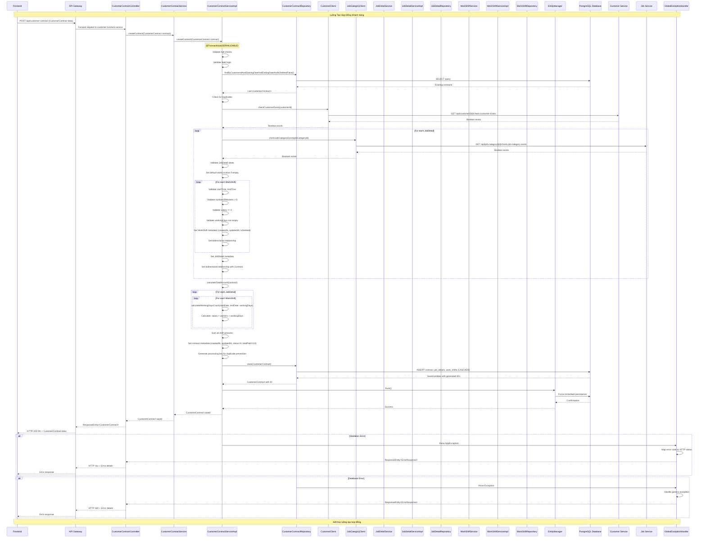

# Luồng Chi Tiết Tạo và Lưu Hợp Đồng trong Customer-Contract-Service

## Tổng Quan Kiến Trúc

Customer-Contract-Service là một microservice độc lập chịu trách nhiệm quản lý hợp đồng khách hàng trong hệ thống quản lý nhân công. Service này giao tiếp với các microservice khác thông qua Feign Client và sử dụng PostgreSQL để lưu trữ dữ liệu.

## Cấu Trúc Entities

### 1. CustomerContract (Entity chính)
- **Thuộc tính chính**: id, customerId, startingDate, endingDate, totalAmount, totalPaid, address, description, status
- **Quan hệ**: OneToMany với JobDetail
- **Trạng thái**: 0: Chờ duyệt, 1: Đang hoạt động, 2: Đã hoàn thành, 3: Đã hủy

### 2. JobDetail (Chi tiết công việc)
- **Thuộc tính chính**: id, jobCategoryId, startDate, endDate, workLocation
- **Quan hệ**: ManyToOne với CustomerContract, OneToMany với WorkShift

### 3. WorkShift (Ca làm việc)
- **Thuộc tính chính**: id, startTime, endTime, numberOfWorkers, salary, workingDays
- **Quan hệ**: ManyToOne với JobDetail

## Luồng Hoạt Động Chi Tiết

### Bước 1: Nhận Request từ Frontend
**Lớp**: `CustomerContractController`
**Phương thức**: `createContract(@RequestBody CustomerContract contract)`
**Endpoint**: `POST /api/customer-contract` hoặc `POST /api/contracts`

```java
@PostMapping
public ResponseEntity<CustomerContract> createContract(@RequestBody CustomerContract contract) {
    return ResponseEntity.ok(contractService.createContract(contract));
}
```

**Dữ liệu nhận được**:
- Thông tin hợp đồng cơ bản (customerId, startingDate, endingDate, address, description)
- Danh sách JobDetail với các WorkShift tương ứng
- totalAmount (sẽ được tính toán lại)

### Bước 2: Chuyển tiếp đến Service Layer
**Lớp**: `CustomerContractServiceImpl`
**Phương thức**: `createContract(CustomerContract contract)`
**Annotation**: `@Transactional(isolation = SERIALIZABLE)`

### Bước 3: Validation Cơ Bản
**Thực hiện bởi**: `CustomerContractServiceImpl.createContract()`

#### 3.1 Kiểm tra dữ liệu đầu vào
```java
if (contract == null) {
    throw new AppException(ErrorCode.NotAllowCreate_Exception, "Thông tin hợp đồng không được để trống");
}

if (contract.getCustomerId() == null) {
    throw new AppException(ErrorCode.CustomerNotFound_Exception, "Mã khách hàng không được để trống");
}
```

#### 3.2 Kiểm tra trùng lặp hợp đồng
**Repository**: `CustomerContractRepository.findByCustomerIdAndStartingDateAndEndingDateAndIsDeletedFalse()`
- Tìm các hợp đồng có cùng customerId, startingDate, endingDate
- Kiểm tra trùng lặp về totalAmount và address

#### 3.3 Validation ngày tháng
```java
if (contract.getStartingDate().isAfter(contract.getEndingDate())) {
    throw new AppException(ErrorCode.InvalidDate_Exception, "Ngày bắt đầu phải trước ngày kết thúc");
}
```

### Bước 4: Validation Thông Qua Microservices
**Sử dụng Feign Clients để gọi API các service khác**

#### 4.1 Kiểm tra Customer tồn tại
**Lớp**: `CustomerClient` (Feign Client)
**Service đích**: customer-service (port 8081)
**Endpoint**: `GET /api/customer/{id}/check-customer-exists`

```java
try {
    Boolean customerExists = customerClient.checkCustomerExists(contract.getCustomerId());
    if (!customerExists) {
        throw new AppException(ErrorCode.CustomerNotFound_Exception, "Không tìm thấy thông tin khách hàng");
    }
} catch (Exception e) {
    System.out.println("Không thể kết nối đến customer-service: " + e.getMessage());
}
```

#### 4.2 Kiểm tra JobCategory tồn tại
**Lớp**: `JobCategoryClient` (Feign Client)
**Service đích**: job-service (port 8082)
**Endpoint**: `GET /api/job-category/{id}/check-job-category-exists`

```java
for (JobDetail jobDetail : contract.getJobDetails()) {
    if (jobDetail.getJobCategoryId() != null) {
        try {
            Boolean jobCategoryExists = jobCategoryClient.checkJobCategoryExists(jobDetail.getJobCategoryId());
            if (!jobCategoryExists) {
                throw new AppException(ErrorCode.JobCategoryNotFound_Exception, "Không tìm thấy thông tin loại công việc");
            }
        } catch (Exception e) {
            System.out.println("Không thể kết nối đến job-service: " + e.getMessage());
        }
    }
}
```

### Bước 5: Validation Chi Tiết JobDetail và WorkShift

#### 5.1 Validation JobDetail
```java
// Kiểm tra ngày bắt đầu và kết thúc
if (jobDetail.getStartDate() == null || jobDetail.getEndDate() == null) {
    throw new AppException(ErrorCode.InvalidInput_Exception, "Ngày bắt đầu và kết thúc công việc không được để trống");
}

// Kiểm tra logic ngày tháng
if (jobDetail.getStartDate().isAfter(jobDetail.getEndDate())) {
    throw new AppException(ErrorCode.InvalidDate_Exception, "Ngày bắt đầu công việc phải trước ngày kết thúc");
}

// Thiết lập địa điểm mặc định nếu không có
if (jobDetail.getWorkLocation() == null || jobDetail.getWorkLocation().trim().isEmpty()) {
    jobDetail.setWorkLocation("Địa điểm sẽ được thông báo sau");
}
```

#### 5.2 Validation WorkShift
```java
for (WorkShift workShift : jobDetail.getWorkShifts()) {
    // Kiểm tra thời gian
    if (workShift.getStartTime() == null || workShift.getStartTime().trim().isEmpty()) {
        throw new AppException(ErrorCode.InvalidInput_Exception, "Giờ bắt đầu ca làm việc không được để trống");
    }

    // Kiểm tra số lượng nhân công
    if (workShift.getNumberOfWorkers() == null || workShift.getNumberOfWorkers() <= 0) {
        throw new AppException(ErrorCode.InvalidInput_Exception, "Số lượng nhân công phải lớn hơn 0");
    }

    // Kiểm tra mức lương
    if (workShift.getSalary() == null || workShift.getSalary() < 0) {
        throw new AppException(ErrorCode.InvalidInput_Exception, "Mức lương phải lớn hơn hoặc bằng 0");
    }

    // Thiết lập quan hệ
    workShift.setJobDetail(jobDetail);
    workShift.setCreatedAt(LocalDateTime.now());
    workShift.setUpdatedAt(LocalDateTime.now());
    workShift.setIsDeleted(false);
}
```

### Bước 6: Tính Toán Tổng Tiền Hợp Đồng
**Phương thức**: `calculateTotalAmount(CustomerContract contract)`

#### 6.1 Thuật toán tính toán
```java
private double calculateTotalAmount(CustomerContract contract) {
    double totalAmount = 0.0;

    for (JobDetail jobDetail : contract.getJobDetails()) {
        for (WorkShift workShift : jobDetail.getWorkShifts()) {
            // Lấy ngày bắt đầu và kết thúc
            LocalDate startDate = jobDetail.getStartDate() != null ? jobDetail.getStartDate() : contract.getStartingDate();
            LocalDate endDate = jobDetail.getEndDate() != null ? jobDetail.getEndDate() : contract.getEndingDate();

            // Tính số ngày làm việc
            int workingDaysCount = calculateWorkingDaysCount(startDate, endDate, workShift.getWorkingDays());

            // Tính tiền: salary × numberOfWorkers × workingDaysCount
            double shiftAmount = workShift.getSalary() * workShift.getNumberOfWorkers() * workingDaysCount;
            totalAmount += shiftAmount;
        }
    }

    return totalAmount;
}
```

#### 6.2 Tính số ngày làm việc
**Phương thức**: `calculateWorkingDaysCount(LocalDate startDate, LocalDate endDate, String workingDays)`

```java
private int calculateWorkingDaysCount(LocalDate startDate, LocalDate endDate, String workingDays) {
    // Parse workingDays (ví dụ: "1,2,3,4,5" cho thứ 2-6)
    String[] dayStrings = workingDays.split(",");
    Set<Integer> workingDaySet = new HashSet<>();

    for (String dayStr : dayStrings) {
        int day = Integer.parseInt(dayStr.trim());
        if (day >= 1 && day <= 7) {
            workingDaySet.add(day);
        }
    }

    // Đếm số ngày làm việc trong khoảng thời gian
    int count = 0;
    LocalDate currentDate = startDate;

    while (!currentDate.isAfter(endDate)) {
        int dayOfWeek = currentDate.getDayOfWeek().getValue(); // 1=Monday, 7=Sunday
        if (workingDaySet.contains(dayOfWeek)) {
            count++;
        }
        currentDate = currentDate.plusDays(1);
    }

    return count;
}
```

### Bước 7: Thiết Lập Metadata và Quan Hệ
```java
// Thiết lập thông tin hợp đồng
contract.setCreatedAt(LocalDateTime.now());
contract.setUpdatedAt(LocalDateTime.now());
contract.setIsDeleted(false);
contract.setStatus(0); // Chờ duyệt
contract.setTotalPaid(0.0);

// Thiết lập quan hệ cho JobDetail
for (JobDetail jobDetail : contract.getJobDetails()) {
    jobDetail.setContract(contract);
    jobDetail.setCreatedAt(LocalDateTime.now());
    jobDetail.setUpdatedAt(LocalDateTime.now());
    jobDetail.setIsDeleted(false);
}
```

### Bước 8: Lưu Vào Database
**Repository**: `CustomerContractRepository`
**Phương thức**: `save(CustomerContract contract)`

```java
try {
    // Tạo unique identifier để tránh duplicate processing
    String processingKey = "contract_" + contract.getCustomerId() + "_" + System.currentTimeMillis();

    // Lưu hợp đồng (cascade sẽ tự động lưu JobDetail và WorkShift)
    CustomerContract savedContract = contractRepository.save(contract);

    // Force flush để đảm bảo dữ liệu được persist ngay lập tức
    entityManager.flush();

    return savedContract;
} catch (Exception e) {
    throw new AppException(ErrorCode.NotAllowCreate_Exception, "Không thể tạo hợp đồng: " + e.getMessage());
}
```

### Bước 9: Xử Lý Response
**Controller trả về**: `ResponseEntity<CustomerContract>`
- Status: 200 OK
- Body: CustomerContract đã được lưu với đầy đủ thông tin (bao gồm ID được generate)

### Bước 10: Error Handling
**Lớp**: `GlobalExceptionHandler`
**Xử lý các loại exception**:
- `AppException`: Lỗi nghiệp vụ (validation, not found, duplicate)
- `Exception`: Lỗi hệ thống

```java
@ExceptionHandler(AppException.class)
public ResponseEntity<Map<String, Object>> handleAppException(AppException ex) {
    Map<String, Object> body = new HashMap<>();
    body.put("code", ex.getCode().getCode());
    body.put("message", ex.getMessage());

    HttpStatus status = determineHttpStatus(ex.getCode());
    return new ResponseEntity<>(body, status);
}
```

## Cấu Hình Microservice Communication

### Feign Client Configuration
```properties
# Service URLs
customer.service.url=http://customer-service:8081/api/customer
job-category.service.url=http://job-service:8082/api/job-category
```

### Database Configuration
```properties
# PostgreSQL
spring.datasource.url=jdbc:postgresql://host.docker.internal:5432/customercontractdb
spring.jpa.hibernate.ddl-auto=validate
```

## Tóm Tắt Luồng Hoạt Động

1. **Frontend** → **API Gateway** → **CustomerContractController**
2. **Controller** → **CustomerContractServiceImpl**
3. **Service** → **Validation cơ bản** (null check, date logic)
4. **Service** → **CustomerClient** (kiểm tra customer tồn tại)
5. **Service** → **JobCategoryClient** (kiểm tra job category tồn tại)
6. **Service** → **Validation chi tiết** (JobDetail, WorkShift)
7. **Service** → **Tính toán tổng tiền** (calculateTotalAmount)
8. **Service** → **Thiết lập metadata và quan hệ**
9. **Service** → **CustomerContractRepository.save()**
10. **Repository** → **PostgreSQL Database**
11. **Service** → **Controller** → **Frontend** (response)

Toàn bộ quá trình được thực hiện trong một transaction với isolation level SERIALIZABLE để đảm bảo tính nhất quán dữ liệu.

## Sơ Đồ Tuần Tự Chi Tiết (Sequence Diagram)



## Các Lớp Tham Gia Trong Sơ Đồ

### Controllers
- **CustomerContractController**: REST controller chính xử lý endpoint `/api/customer-contract`
- **ContractController**: REST controller phụ xử lý endpoint `/api/contracts` (tương thích)

### Services & Implementations
- **CustomerContractService**: Interface định nghĩa các phương thức nghiệp vụ
- **CustomerContractServiceImpl**: Implementation chính chứa logic tạo hợp đồng
- **JobDetailService**: Interface quản lý chi tiết công việc
- **JobDetailServiceImpl**: Implementation xử lý JobDetail
- **WorkShiftService**: Interface quản lý ca làm việc
- **WorkShiftServiceImpl**: Implementation xử lý WorkShift

### Repositories
- **CustomerContractRepository**: JPA Repository cho CustomerContract entity
- **JobDetailRepository**: JPA Repository cho JobDetail entity
- **WorkShiftRepository**: JPA Repository cho WorkShift entity

### Feign Clients (Microservice Communication)
- **CustomerClient**: Gọi API đến customer-service để validate customer
- **JobCategoryClient**: Gọi API đến job-service để validate job category

### Infrastructure
- **EntityManager**: JPA EntityManager để quản lý persistence context
- **GlobalExceptionHandler**: Xử lý exception và mapping sang HTTP response
- **PostgreSQL Database**: Cơ sở dữ liệu lưu trữ

### External Services
- **Customer Service**: Microservice quản lý thông tin khách hàng (port 8081)
- **Job Service**: Microservice quản lý danh mục công việc (port 8082)
