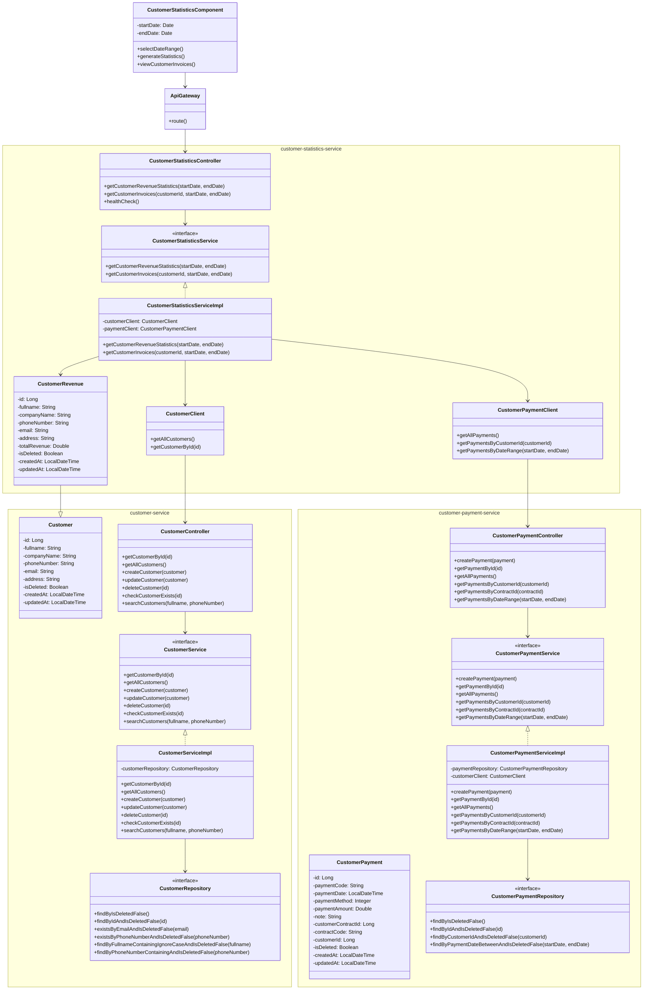

# Sơ đồ lớp đơn giản cho Module Thống kê Khách hàng theo Doanh thu

## Tổng quan

Module thống kê khách hàng theo doanh thu cho phép quản lý xem thống kê doanh thu từ khách hàng trong một khoảng thời gian cụ thể. Module này sử dụng kiến trúc microservice, với các microservice sau tham gia:

1. **customer-statistics-service**: Dịch vụ chính xử lý thống kê doanh thu khách hàng
2. **customer-service**: Cung cấp thông tin về khách hàng
3. **customer-payment-service**: Cung cấp thông tin về các khoản thanh toán

## Sơ đồ lớp

## Giải thích chi tiết các thành phần

### 1. Frontend
- **CustomerStatisticsComponent**: Component frontend cho phép người dùng chọn khoảng thời gian và hiển thị kết quả thống kê.

### 2. API Gateway
- **ApiGateway**: Cổng vào duy nhất cho tất cả các request từ frontend đến các microservice.

### 3. customer-statistics-service
- **CustomerStatisticsController**: Controller xử lý các request liên quan đến thống kê khách hàng.
  - `getCustomerRevenueStatistics(startDate, endDate)`: Lấy thống kê doanh thu theo khách hàng trong khoảng thời gian.
  - `getCustomerInvoices(customerId, startDate, endDate)`: Lấy danh sách hóa đơn của khách hàng trong khoảng thời gian.
  - `healthCheck()`: Kiểm tra trạng thái hoạt động của service.

- **CustomerStatisticsService**: Interface định nghĩa các phương thức xử lý logic nghiệp vụ liên quan đến thống kê.
  - `getCustomerRevenueStatistics(startDate, endDate)`: Lấy thống kê doanh thu theo khách hàng trong khoảng thời gian.
  - `getCustomerInvoices(customerId, startDate, endDate)`: Lấy danh sách hóa đơn của khách hàng trong khoảng thời gian.

- **CustomerStatisticsServiceImpl**: Lớp triển khai CustomerStatisticsService, thực hiện các phương thức xử lý logic nghiệp vụ.
  - `customerClient`: Feign client gọi đến customer-service.
  - `paymentClient`: Feign client gọi đến customer-payment-service.

- **CustomerRevenue**: Model kế thừa từ Customer, chứa thêm thông tin thống kê doanh thu.
  - `totalRevenue`: Tổng doanh thu từ khách hàng.

- **CustomerClient**: Feign client gọi đến customer-service.
  - `getAllCustomers()`: Lấy danh sách tất cả khách hàng.
  - `getCustomerById(id)`: Lấy thông tin khách hàng theo ID.

- **CustomerPaymentClient**: Feign client gọi đến customer-payment-service.
  - `getAllPayments()`: Lấy danh sách tất cả thanh toán.
  - `getPaymentsByCustomerId(customerId)`: Lấy danh sách thanh toán theo ID khách hàng.
  - `getPaymentsByDateRange(startDate, endDate)`: Lấy danh sách thanh toán trong khoảng thời gian.

### 4. customer-service
- **Customer**: Entity chứa thông tin khách hàng.
  - `id`: ID khách hàng.
  - `fullname`: Tên khách hàng.
  - `companyName`: Tên doanh nghiệp.
  - `phoneNumber`: Số điện thoại.
  - `email`: Email.
  - `address`: Địa chỉ.
  - `isDeleted`: Đánh dấu đã xóa.
  - `createdAt`: Thời gian tạo.
  - `updatedAt`: Thời gian cập nhật.

- **CustomerController**: Controller xử lý các request liên quan đến khách hàng.
- **CustomerService**: Interface định nghĩa các phương thức xử lý logic nghiệp vụ liên quan đến khách hàng.
- **CustomerServiceImpl**: Lớp triển khai CustomerService.
- **CustomerRepository**: Interface truy cập dữ liệu khách hàng.

### 5. customer-payment-service
- **CustomerPayment**: Entity chứa thông tin thanh toán.
  - `id`: ID thanh toán.
  - `paymentCode`: Mã thanh toán.
  - `paymentDate`: Ngày thanh toán.
  - `paymentMethod`: Phương thức thanh toán.
  - `paymentAmount`: Số tiền thanh toán.
  - `note`: Ghi chú.
  - `customerContractId`: ID hợp đồng.
  - `contractCode`: Mã hợp đồng.
  - `customerId`: ID khách hàng.
  - `isDeleted`: Đánh dấu đã xóa.
  - `createdAt`: Thời gian tạo.
  - `updatedAt`: Thời gian cập nhật.

- **CustomerPaymentController**: Controller xử lý các request liên quan đến thanh toán.
- **CustomerPaymentService**: Interface định nghĩa các phương thức xử lý logic nghiệp vụ liên quan đến thanh toán.
- **CustomerPaymentServiceImpl**: Lớp triển khai CustomerPaymentService.
- **CustomerPaymentRepository**: Interface truy cập dữ liệu thanh toán.
