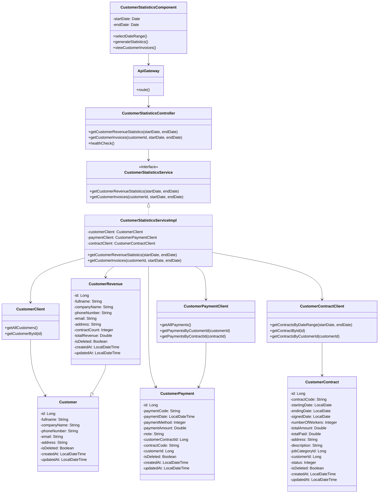

# Sơ đồ lớp chi tiết cho Module Thống kê Khách hàng theo Doanh thu

## Tổng quan

Module thống kê khách hàng theo doanh thu cho phép quản lý xem thống kê doanh thu từ khách hàng trong một khoảng thời gian cụ thể. Module này sử dụng kiến trúc microservice, với các microservice sau tham gia:

1. **customer-statistics-service**: Dịch vụ chính xử lý thống kê doanh thu khách hàng
2. **customer-service**: Cung cấp thông tin về khách hàng
3. **customer-payment-service**: Cung cấp thông tin về các khoản thanh toán
4. **customer-contract-service**: Cung cấp thông tin về hợp đồng

## Sơ đồ lớp

## Giải thích chi tiết các thành phần

### 1. Frontend
- **CustomerStatisticsComponent**: Component frontend cho phép người dùng chọn khoảng thời gian và hiển thị kết quả thống kê.

### 2. API Gateway
- **ApiGateway**: Cổng vào duy nhất cho tất cả các request từ frontend đến các microservice.

### 3. customer-statistics-service
- **CustomerStatisticsController**: Controller xử lý các request liên quan đến thống kê khách hàng.
  - `getCustomerRevenueStatistics(startDate, endDate)`: Lấy thống kê doanh thu theo khách hàng trong khoảng thời gian.
  - `getCustomerInvoices(customerId, startDate, endDate)`: Lấy danh sách hóa đơn của khách hàng trong khoảng thời gian.
  - `healthCheck()`: Kiểm tra trạng thái hoạt động của service.

- **CustomerStatisticsService**: Interface định nghĩa các phương thức xử lý logic nghiệp vụ liên quan đến thống kê.
  - `getCustomerRevenueStatistics(startDate, endDate)`: Lấy thống kê doanh thu theo khách hàng trong khoảng thời gian.
  - `getCustomerInvoices(customerId, startDate, endDate)`: Lấy danh sách hóa đơn của khách hàng trong khoảng thời gian.

- **CustomerStatisticsServiceImpl**: Lớp triển khai CustomerStatisticsService, thực hiện các phương thức xử lý logic nghiệp vụ.
  - `customerClient`: Feign client gọi đến customer-service.
  - `paymentClient`: Feign client gọi đến customer-payment-service.
  - `contractClient`: Feign client gọi đến customer-contract-service.

- **CustomerRevenue**: Model kế thừa từ Customer, chứa thêm thông tin thống kê doanh thu.
  - `contractCount`: Số lượng hợp đồng đã ký.
  - `totalRevenue`: Tổng doanh thu từ khách hàng.

- **CustomerClient**: Feign client gọi đến customer-service.
  - `getAllCustomers()`: Lấy danh sách tất cả khách hàng.
  - `getCustomerById(id)`: Lấy thông tin khách hàng theo ID.

- **CustomerPaymentClient**: Feign client gọi đến customer-payment-service.
  - `getAllPayments()`: Lấy danh sách tất cả thanh toán.
  - `getPaymentsByCustomerId(customerId)`: Lấy danh sách thanh toán theo ID khách hàng.
  - `getPaymentsByContractId(contractId)`: Lấy danh sách thanh toán theo ID hợp đồng.

- **CustomerContractClient**: Feign client gọi đến customer-contract-service.
  - `getContractsByDateRange(startDate, endDate)`: Lấy danh sách hợp đồng trong khoảng thời gian.
  - `getContractById(id)`: Lấy thông tin hợp đồng theo ID.
  - `getContractsByCustomerId(customerId)`: Lấy danh sách hợp đồng theo ID khách hàng.

### 4. Model từ các microservice khác
- **Customer**: Model chứa thông tin khách hàng.
  - `id`: ID khách hàng.
  - `fullname`: Tên khách hàng.
  - `companyName`: Tên doanh nghiệp.
  - `phoneNumber`: Số điện thoại.
  - `email`: Email.
  - `address`: Địa chỉ.
  - `isDeleted`: Đánh dấu đã xóa.
  - `createdAt`: Thời gian tạo.
  - `updatedAt`: Thời gian cập nhật.

- **CustomerPayment**: Model chứa thông tin thanh toán.
  - `id`: ID thanh toán.
  - `paymentCode`: Mã thanh toán.
  - `paymentDate`: Ngày thanh toán.
  - `paymentMethod`: Phương thức thanh toán.
  - `paymentAmount`: Số tiền thanh toán.
  - `note`: Ghi chú.
  - `customerContractId`: ID hợp đồng.
  - `contractCode`: Mã hợp đồng.
  - `customerId`: ID khách hàng.
  - `isDeleted`: Đánh dấu đã xóa.
  - `createdAt`: Thời gian tạo.
  - `updatedAt`: Thời gian cập nhật.

- **CustomerContract**: Model chứa thông tin hợp đồng.
  - `id`: ID hợp đồng.
  - `contractCode`: Mã hợp đồng.
  - `startingDate`: Ngày bắt đầu.
  - `endingDate`: Ngày kết thúc.
  - `signedDate`: Ngày ký.
  - `numberOfWorkers`: Số lượng nhân công.
  - `totalAmount`: Tổng giá trị hợp đồng.
  - `totalPaid`: Tổng số tiền đã thanh toán.
  - `address`: Địa chỉ làm việc.
  - `description`: Mô tả công việc.
  - `jobCategoryId`: ID loại công việc.
  - `customerId`: ID khách hàng.
  - `status`: Trạng thái hợp đồng.
  - `isDeleted`: Đánh dấu đã xóa.
  - `createdAt`: Thời gian tạo.
  - `updatedAt`: Thời gian cập nhật.

## Luồng hoạt động

1. Quản lý chọn chức năng thống kê khách hàng theo doanh thu
2. Hệ thống hiển thị giao diện thống kê với form chọn khoảng thời gian
3. Quản lý chọn khoảng thời gian và bấm nút thống kê
4. Frontend gửi request đến API Gateway
5. API Gateway định tuyến request đến CustomerStatisticsController
6. CustomerStatisticsController gọi phương thức getCustomerRevenueStatistics() của CustomerStatisticsService
7. CustomerStatisticsServiceImpl thực hiện các bước sau:
   - Lấy danh sách khách hàng từ CustomerClient
   - Lấy danh sách hợp đồng trong khoảng thời gian từ CustomerContractClient
   - Lấy danh sách thanh toán từ CustomerPaymentClient
   - Tính toán số lượng hợp đồng và tổng doanh thu cho mỗi khách hàng
   - Sắp xếp kết quả theo tổng doanh thu từ cao đến thấp
8. Kết quả được trả về qua các lớp trung gian, thông qua API Gateway đến Frontend
9. Frontend hiển thị danh sách khách hàng với thông tin thống kê
10. Khi quản lý click vào một khách hàng:
    - Frontend gửi request đến API Gateway để lấy danh sách hóa đơn của khách hàng đó
    - CustomerStatisticsController gọi phương thức getCustomerInvoices() của CustomerStatisticsService
    - CustomerStatisticsServiceImpl lấy danh sách thanh toán của khách hàng từ CustomerPaymentClient
    - Kết quả được trả về và hiển thị trên Frontend

## Lưu ý về kiến trúc microservice

- **customer-statistics-service** không có cơ sở dữ liệu riêng mà chỉ tổng hợp dữ liệu từ các service khác
- Giao tiếp giữa các service thông qua REST API sử dụng Feign Client
- API Gateway đóng vai trò trung gian giữa Frontend và các microservice
- CustomerRevenue kế thừa từ Customer để tái sử dụng các thuộc tính của Customer và thêm các thuộc tính thống kê
