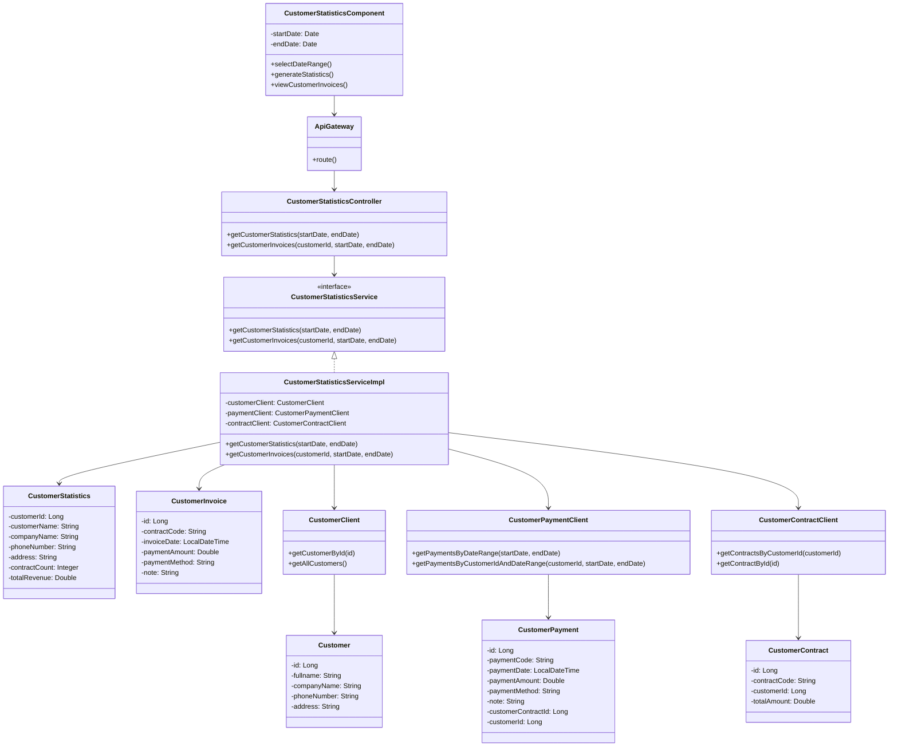

# Sơ đồ lớp chi tiết cho Module Thống kê Khách hàng theo Doanh thu

## Tổng quan

Module thống kê khách hàng theo doanh thu cho phép quản lý xem thống kê doanh thu từ khách hàng trong một khoảng thời gian cụ thể. Module này sử dụng kiến trúc microservice, với các microservice sau tham gia:

1. **customer-statistics-service**: Dịch vụ chính xử lý thống kê doanh thu khách hàng
2. **customer-service**: Cung cấp thông tin về khách hàng
3. **customer-payment-service**: Cung cấp thông tin về các khoản thanh toán
4. **customer-contract-service**: Cung cấp thông tin về hợp đồng

## Sơ đồ lớp

## Giải thích chi tiết các thành phần

### 1. Frontend
- **CustomerStatisticsComponent**: Component frontend cho phép người dùng chọn khoảng thời gian và hiển thị kết quả thống kê.

### 2. API Gateway
- **ApiGateway**: Cổng vào duy nhất cho tất cả các request từ frontend đến các microservice.

### 3. customer-statistics-service
- **CustomerStatisticsController**: Controller xử lý các request liên quan đến thống kê khách hàng.
- **CustomerStatisticsService**: Interface định nghĩa các phương thức xử lý logic nghiệp vụ liên quan đến thống kê.
- **CustomerStatisticsServiceImpl**: Lớp triển khai CustomerStatisticsService, thực hiện các phương thức xử lý logic nghiệp vụ.
- **CustomerStatistics**: DTO chứa thông tin thống kê của một khách hàng.
- **CustomerInvoice**: DTO chứa thông tin chi tiết về một hóa đơn.
- **CustomerClient**: Feign client gọi đến customer-service.
- **CustomerPaymentClient**: Feign client gọi đến customer-payment-service.
- **CustomerContractClient**: Feign client gọi đến customer-contract-service.

### 4. customer-service
- **Customer**: Entity chứa thông tin khách hàng.

### 5. customer-payment-service
- **CustomerPayment**: Entity chứa thông tin thanh toán.

### 6. customer-contract-service
- **CustomerContract**: Entity chứa thông tin hợp đồng.

## Luồng hoạt động

1. Quản lý chọn chức năng thống kê khách hàng theo doanh thu
2. Hệ thống hiển thị giao diện thống kê với form chọn khoảng thời gian
3. Quản lý chọn khoảng thời gian và bấm nút thống kê
4. Frontend gửi request đến API Gateway
5. API Gateway định tuyến request đến CustomerStatisticsController
6. CustomerStatisticsController gọi phương thức getCustomerStatistics() của CustomerStatisticsService
7. CustomerStatisticsServiceImpl thực hiện các bước sau:
   - Lấy danh sách thanh toán trong khoảng thời gian từ CustomerPaymentClient
   - Lấy thông tin khách hàng từ CustomerClient
   - Lấy thông tin hợp đồng từ CustomerContractClient
   - Tính toán số lượng hợp đồng và tổng doanh thu cho mỗi khách hàng
   - Sắp xếp kết quả theo tổng doanh thu từ cao đến thấp
8. Kết quả được trả về qua các lớp trung gian, thông qua API Gateway đến Frontend
9. Frontend hiển thị danh sách khách hàng với thông tin thống kê
10. Khi quản lý click vào một khách hàng:
    - Frontend gửi request đến API Gateway để lấy danh sách hóa đơn của khách hàng đó
    - CustomerStatisticsController gọi phương thức getCustomerInvoices() của CustomerStatisticsService
    - CustomerStatisticsServiceImpl lấy danh sách thanh toán của khách hàng từ CustomerPaymentClient
    - Kết quả được trả về và hiển thị trên Frontend

## Lưu ý về kiến trúc microservice

- **customer-statistics-service** không có cơ sở dữ liệu riêng mà chỉ tổng hợp dữ liệu từ các service khác
- Giao tiếp giữa các service thông qua REST API sử dụng Feign Client
- API Gateway đóng vai trò trung gian giữa Frontend và các microservice
- Các DTO (CustomerStatistics, CustomerInvoice) được sử dụng để truyền dữ liệu giữa các service và đến Frontend
