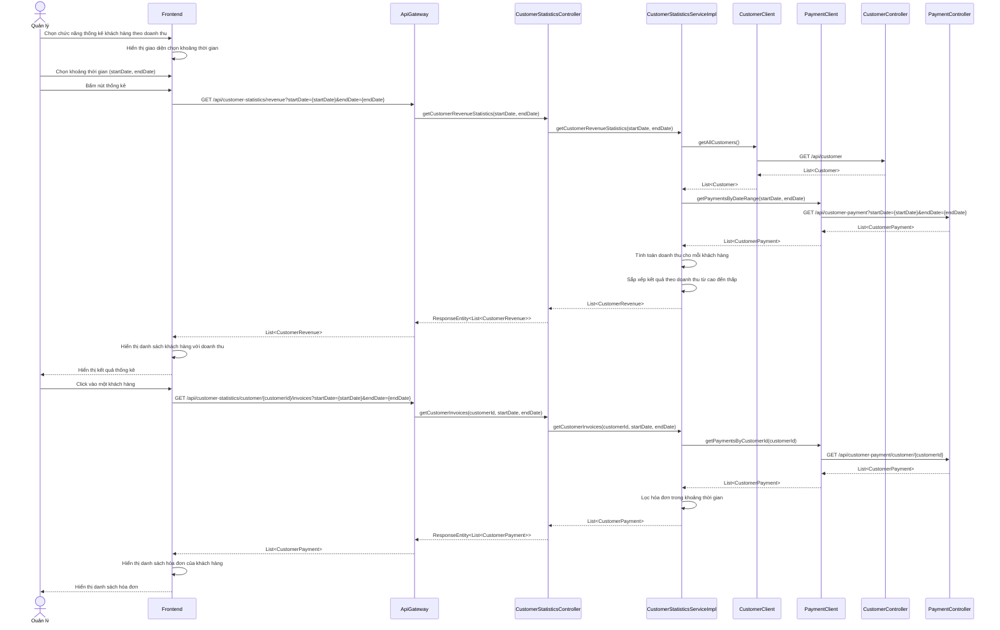

# Sơ đồ tuần tự cho Module Thống kê Khách hàng theo Doanh thu

## Tổng quan

Sơ đồ tuần tự này mô tả luồng hoạt động của module "Thống kê khách hàng theo doanh thu", bao gồm các bước từ khi quản lý chọn chức năng thống kê đến khi hiển thị kết quả và xem chi tiết hóa đơn của khách hàng.

## Sơ đồ tuần tự

## Giải thích chi tiết luồng hoạt động

### 1. Hiển thị giao diện thống kê
- Quản lý chọn chức năng thống kê khách hàng theo doanh thu
- Frontend hiển thị giao diện chọn khoảng thời gian

### 2. Chọn khoảng thời gian và thực hiện thống kê
- Quản lý chọn khoảng thời gian (ngày bắt đầu, ngày kết thúc)
- Quản lý bấm nút thống kê
- Frontend gửi request đến API Gateway
- API Gateway định tuyến request đến CustomerStatisticsController
- CustomerStatisticsController gọi phương thức getCustomerRevenueStatistics() của CustomerStatisticsService

### 3. Lấy dữ liệu và tính toán thống kê
- CustomerStatisticsServiceImpl lấy danh sách khách hàng từ CustomerClient
- CustomerStatisticsServiceImpl lấy danh sách thanh toán trong khoảng thời gian từ PaymentClient
- CustomerStatisticsServiceImpl tính toán tổng doanh thu cho mỗi khách hàng
- CustomerStatisticsServiceImpl sắp xếp kết quả theo tổng doanh thu từ cao đến thấp

### 4. Hiển thị kết quả thống kê
- Kết quả được trả về qua các lớp trung gian, thông qua API Gateway đến Frontend
- Frontend hiển thị danh sách khách hàng với thông tin doanh thu

### 5. Xem chi tiết hóa đơn của khách hàng
- Quản lý click vào một khách hàng để xem chi tiết hóa đơn
- Frontend gửi request đến API Gateway để lấy danh sách hóa đơn của khách hàng đó
- CustomerStatisticsController gọi phương thức getCustomerInvoices() của CustomerStatisticsService
- CustomerStatisticsServiceImpl lấy danh sách thanh toán của khách hàng từ PaymentClient
- CustomerStatisticsServiceImpl lọc hóa đơn trong khoảng thời gian đã chọn
- Kết quả được trả về và hiển thị trên Frontend
