# Sơ đồ lớp chi tiết cho module "Nhận thanh toán từ khách thuê lao động"

Sơ đồ lớp dưới đây mô tả chi tiết các lớp và mối quan hệ giữa chúng trong module "Nhận thanh toán từ khách thuê lao động" theo kiến trúc vi dịch vụ (microservices). Mỗi microservice được thể hiện như một package riêng biệt.

## Các thành phần tham gia

1. **frontend**: Giao diện người dùng
2. **api-gateway**: Cổng vào cho tất cả các request từ frontend đến các microservice
3. **customer-service**: Quản lý thông tin khách hàng
4. **customer-contract-service**: Quản lý hợp đồng với khách hàng
5. **customer-payment-service**: Quản lý thanh toán hợp đồng
6. **customer-statistics-service**: Thống kê doanh thu từ khách hàng

## Sơ đồ lớp

```mermaid
classDiagram
    %% Microservice packages
    namespace frontend {
        class CustomerPaymentList
        class CustomerPaymentDialog
    }

    namespace api-gateway {
        class ApiGateway
        class RouteConfig
        class AuthFilter
        class LoadBalancer
    }

    namespace customer-service {
        class CustomerController
        class CustomerService
        class CustomerServiceImpl
        class Customer
        class CustomerRepository
    }

    namespace customer-contract-service {
        class CustomerContractController
        class CustomerContractService
        class CustomerContractServiceImpl
        class CustomerContract
        class CustomerContractRepository
    }

    namespace customer-payment-service {
        class CustomerPaymentController
        class CustomerPaymentService
        class CustomerPaymentServiceImpl
        class CustomerPayment
        class CustomerPaymentRepository
        class ContractPaymentInfo
        class CustomerClient
        class CustomerContractClient
    }

    namespace customer-statistics-service {
        class CustomerStatisticsController
        class CustomerStatisticsService
        class CustomerStatisticsServiceImpl
        class CustomerPaymentClient
        class CustomerClient
        class CustomerContractClient
    }

    %% Customer Service
    class Customer {
        +Long id
        +String fullname
        +String companyName
        +String phoneNumber
        +String email
        +String address
        +Boolean isDeleted
        +LocalDateTime createdAt
        +LocalDateTime updatedAt
    }

    class CustomerController {
        +ResponseEntity<Customer> getCustomerById(Long id)
        +ResponseEntity<Customer> createCustomer(Customer customer)
        +ResponseEntity<List<Customer>> getAllCustomers()
        +ResponseEntity<Customer> updateCustomer(Customer customer)
        +ResponseEntity<Void> deleteCustomer(Long id)
        +ResponseEntity<Boolean> checkCustomerExists(Long id)
        +ResponseEntity<List<Customer>> searchCustomers(String fullName, String phoneNumber)
    }

    class CustomerService {
        <<interface>>
        +Customer getCustomerById(Long id)
        +Customer createCustomer(Customer customer)
        +List<Customer> getAllCustomers()
        +Customer updateCustomer(Customer customer)
        +void deleteCustomer(Long id)
        +boolean checkCustomerExists(Long id)
        +List<Customer> searchCustomers(String fullName, String phoneNumber)
    }

    class CustomerServiceImpl {
        +Customer getCustomerById(Long id)
        +Customer createCustomer(Customer customer)
        +List<Customer> getAllCustomers()
        +Customer updateCustomer(Customer customer)
        +void deleteCustomer(Long id)
        +boolean checkCustomerExists(Long id)
        +List<Customer> searchCustomers(String fullName, String phoneNumber)
    }

    class CustomerRepository {
        <<interface>>
        +Optional<Customer> findByIdAndIsDeletedFalse(Long id)
        +List<Customer> findByIsDeletedFalse()
        +List<Customer> findByFullNameContainingAndIsDeletedFalse(String fullName)
        +List<Customer> findByPhoneNumberContainingAndIsDeletedFalse(String phoneNumber)
    }

    %% Customer Contract Service
    class CustomerContract {
        +Long id
        +String contractCode
        +LocalDate startingDate
        +LocalDate endingDate
        +LocalDate signedDate
        +Integer numberOfWorkers
        +Double totalAmount
        +String address
        +String description
        +Long jobCategoryId
        +Long customerId
        +Integer status
        +Boolean isDeleted
        +LocalDateTime createdAt
        +LocalDateTime updatedAt
    }

    class CustomerContractController {
        +ResponseEntity<CustomerContract> getContractById(Long id)
        +ResponseEntity<CustomerContract> createContract(CustomerContract contract)
        +ResponseEntity<List<CustomerContract>> getAllContracts()
        +ResponseEntity<CustomerContract> updateContract(CustomerContract contract)
        +ResponseEntity<Void> deleteContract(Long id)
        +ResponseEntity<Boolean> checkContractExists(Long id)
        +ResponseEntity<List<CustomerContract>> getContractsByCustomerId(Long customerId)
        +ResponseEntity<List<CustomerContract>> getContractsByStatus(Integer status)
    }

    class CustomerContractService {
        <<interface>>
        +CustomerContract getContractById(Long id)
        +CustomerContract createContract(CustomerContract contract)
        +List<CustomerContract> getAllContracts()
        +CustomerContract updateContract(CustomerContract contract)
        +void deleteContract(Long id)
        +boolean checkContractExists(Long id)
        +List<CustomerContract> getContractsByCustomerId(Long customerId)
        +List<CustomerContract> getContractsByStatus(Integer status)
    }

    class CustomerContractServiceImpl {
        +CustomerContract getContractById(Long id)
        +CustomerContract createContract(CustomerContract contract)
        +List<CustomerContract> getAllContracts()
        +CustomerContract updateContract(CustomerContract contract)
        +void deleteContract(Long id)
        +boolean checkContractExists(Long id)
        +List<CustomerContract> getContractsByCustomerId(Long customerId)
        +List<CustomerContract> getContractsByStatus(Integer status)
    }

    class CustomerContractRepository {
        <<interface>>
        +Optional<CustomerContract> findByIdAndIsDeletedFalse(Long id)
        +List<CustomerContract> findByIsDeletedFalse()
        +List<CustomerContract> findByCustomerIdAndIsDeletedFalse(Long customerId)
        +List<CustomerContract> findByStatusAndIsDeletedFalse(Integer status)
    }

    %% Customer Payment Service
    class CustomerPayment {
        +Long id
        +String paymentCode
        +LocalDateTime paymentDate
        +Integer paymentMethod
        +Double paymentAmount
        +String note
        +Long customerContractId
        +Long customerId
        +Boolean isDeleted
        +LocalDateTime createdAt
        +LocalDateTime updatedAt
    }

    class ContractPaymentInfo {
        +Long contractId
        +String contractCode
        +LocalDate startingDate
        +LocalDate endingDate
        +Double totalAmount
        +Double totalPaid
        +Double totalDue
        +String customerName
        +Long customerId
        +Integer status
    }

    class CustomerPaymentController {
        +ResponseEntity<String> healthCheck()
        +ResponseEntity<CustomerPayment> getPaymentById(Long id)
        +ResponseEntity<CustomerPayment> createPayment(CustomerPayment payment)
        +ResponseEntity<List<CustomerPayment>> getAllPayments()
        +ResponseEntity<List<Customer>> searchCustomers(String fullname, String phoneNumber)
        +ResponseEntity<List<CustomerPayment>> getPaymentsByCustomerId(Long customerId)
        +ResponseEntity<List<CustomerPayment>> getPaymentsByContractId(Long contractId)
        +ResponseEntity<List<ContractPaymentInfo>> getActiveContractsByCustomerId(Long customerId)
        +ResponseEntity<ContractPaymentInfo> getContractPaymentInfo(Long contractId)
        +ResponseEntity<Double> getTotalPaidAmountByContractId(Long contractId)
        +ResponseEntity<Double> getRemainingAmountByContractId(Long contractId)
    }

    class CustomerPaymentService {
        <<interface>>
        +CustomerPayment createPayment(CustomerPayment payment)
        +CustomerPayment getPaymentById(Long id)
        +List<CustomerPayment> getAllPayments()
        +List<CustomerPayment> getPaymentsByCustomerId(Long customerId)
        +List<CustomerPayment> getPaymentsByContractId(Long contractId)
        +List<Customer> searchCustomers(String fullname, String phoneNumber)
        +List<ContractPaymentInfo> getActiveContractsByCustomerId(Long customerId)
        +ContractPaymentInfo getContractPaymentInfo(Long contractId)
        +Double getTotalPaidAmountByContractId(Long contractId)
        +Double getRemainingAmountByContractId(Long contractId)
    }

    class CustomerPaymentServiceImpl {
        +CustomerPayment createPayment(CustomerPayment payment)
        +CustomerPayment getPaymentById(Long id)
        +List<CustomerPayment> getAllPayments()
        +List<CustomerPayment> getPaymentsByCustomerId(Long customerId)
        +List<CustomerPayment> getPaymentsByContractId(Long contractId)
        +List<Customer> searchCustomers(String fullname, String phoneNumber)
        +List<ContractPaymentInfo> getActiveContractsByCustomerId(Long customerId)
        +ContractPaymentInfo getContractPaymentInfo(Long contractId)
        +Double getTotalPaidAmountByContractId(Long contractId)
        +Double getRemainingAmountByContractId(Long contractId)
    }

    class CustomerPaymentRepository {
        <<interface>>
        +List<CustomerPayment> findByIsDeletedFalse()
        +Optional<CustomerPayment> findByIdAndIsDeletedFalse(Long id)
        +List<CustomerPayment> findByCustomerIdAndIsDeletedFalse(Long customerId)
        +List<CustomerPayment> findByCustomerContractIdAndIsDeletedFalse(Long customerContractId)
        +Double getTotalPaidAmountByContractId(Long contractId)
        +Boolean existsByPaymentCodeAndIsDeletedFalse(String paymentCode)
    }

    class CustomerClient {
        <<interface>>
        +Customer getCustomerById(Long id)
        +Boolean checkCustomerExists(Long id)
        +List<Customer> getAllCustomers()
        +List<Customer> searchCustomers(String fullname, String phoneNumber)
    }

    class CustomerContractClient {
        <<interface>>
        +CustomerContract getContractById(Long id)
        +Boolean checkContractExists(Long id)
        +List<CustomerContract> getAllContracts()
        +List<CustomerContract> getContractsByCustomerId(Long customerId)
        +List<CustomerContract> getContractsByStatus(Integer status)
    }

    %% Customer Statistics Service
    class CustomerStatisticsController {
        +ResponseEntity<List<CustomerRevenueDTO>> getAllCustomerRevenues()
        +ResponseEntity<CustomerRevenueDTO> getCustomerRevenueById(Long customerId)
        +ResponseEntity<List<CustomerPayment>> getCustomerInvoices(Long customerId)
    }

    class CustomerStatisticsService {
        <<interface>>
        +List<CustomerRevenueDTO> getAllCustomerRevenues()
        +CustomerRevenueDTO getCustomerRevenueById(Long customerId)
        +List<CustomerPayment> getCustomerInvoices(Long customerId)
    }

    class CustomerStatisticsServiceImpl {
        +List<CustomerRevenueDTO> getAllCustomerRevenues()
        +CustomerRevenueDTO getCustomerRevenueById(Long customerId)
        +List<CustomerPayment> getCustomerInvoices(Long customerId)
    }

    class CustomerPaymentClient {
        <<interface>>
        +List<CustomerPayment> getAllPayments()
        +List<CustomerPayment> getPaymentsByCustomerId(Long customerId)
        +List<CustomerPayment> getPaymentsByContractId(Long contractId)
    }

    %% Frontend Components
    class CustomerPaymentList {
        -List<Customer> customers
        -Customer selectedCustomer
        -List<ContractPaymentInfo> activeContracts
        -ContractPaymentInfo selectedContract
        -Double paymentAmount
        -String paymentDescription
        -Boolean paymentDialogVisible
        -Boolean contractsDialogVisible
        +fetchCustomers()
        +searchCustomers()
        +fetchActiveContracts(customerId)
        +selectCustomer(customer)
        +openPaymentDialog(contract)
        +handlePayment()
        +formatCurrency(value)
        +formatDate(date)
    }

    class CustomerPaymentDialog {
        -ContractPaymentInfo contract
        -Double paymentAmount
        -String paymentDescription
        -Boolean visible
        +onHide()
        +onSubmit()
    }

    %% Relationships

    %% API Gateway Relationships
    ApiGateway --> RouteConfig
    ApiGateway --> AuthFilter
    ApiGateway --> LoadBalancer

    %% Frontend to API Gateway Relationships
    CustomerPaymentList ..> ApiGateway : "HTTP"
    CustomerPaymentDialog ..> ApiGateway : "HTTP"

    %% API Gateway to Microservices Relationships
    ApiGateway ..> CustomerPaymentController : "HTTP"
    ApiGateway ..> CustomerController : "HTTP"
    ApiGateway ..> CustomerContractController : "HTTP"
    ApiGateway ..> CustomerStatisticsController : "HTTP"

    %% Customer Service Relationships
    CustomerController --> CustomerService
    CustomerService <|.. CustomerServiceImpl
    CustomerServiceImpl --> CustomerRepository
    CustomerRepository --> Customer

    %% Customer Contract Service Relationships
    CustomerContractController --> CustomerContractService
    CustomerContractService <|.. CustomerContractServiceImpl
    CustomerContractServiceImpl --> CustomerContractRepository
    CustomerContractRepository --> CustomerContract

    %% Customer Payment Service Relationships
    CustomerPaymentController --> CustomerPaymentService
    CustomerPaymentService <|.. CustomerPaymentServiceImpl
    CustomerPaymentServiceImpl --> CustomerPaymentRepository
    CustomerPaymentRepository --> CustomerPayment
    CustomerPaymentServiceImpl --> CustomerClient
    CustomerPaymentServiceImpl --> CustomerContractClient
    CustomerPaymentServiceImpl ..> ContractPaymentInfo : "creates"

    %% Customer Statistics Service Relationships
    CustomerStatisticsController --> CustomerStatisticsService
    CustomerStatisticsService <|.. CustomerStatisticsServiceImpl
    CustomerStatisticsServiceImpl --> CustomerPaymentClient
    CustomerStatisticsServiceImpl --> CustomerClient
    CustomerStatisticsServiceImpl --> CustomerContractClient

    %% Frontend Component Relationships
    CustomerPaymentList --> CustomerPaymentDialog
```

## Giải thích chi tiết các thành phần trong sơ đồ

### 1. frontend

#### Components
- **CustomerPaymentList**: Component hiển thị danh sách khách hàng và xử lý các thao tác tìm kiếm, chọn khách hàng, hiển thị hợp đồng và thanh toán.
- **CustomerPaymentDialog**: Dialog nhập thông tin thanh toán cho hợp đồng.

### 2. api-gateway

#### Components
- **ApiGateway**: Lớp chính xử lý việc định tuyến các request từ frontend đến các microservice tương ứng.
- **RouteConfig**: Lớp cấu hình các route, ánh xạ các đường dẫn URL đến các microservice.
- **AuthFilter**: Bộ lọc xác thực, kiểm tra và xác thực token trước khi chuyển tiếp request.
- **LoadBalancer**: Lớp cân bằng tải, phân phối các request đến các instance khác nhau của cùng một microservice.

### 3. customer-service

#### Entities
- **Customer**: Entity chứa thông tin khách hàng với các thuộc tính như id, fullname, companyName, phoneNumber, email, address, isDeleted, createdAt, updatedAt.

#### Controllers
- **CustomerController**: Controller xử lý các request liên quan đến khách hàng, cung cấp các endpoint như getCustomerById, createCustomer, getAllCustomers, updateCustomer, deleteCustomer, checkCustomerExists, searchCustomers.

#### Services
- **CustomerService**: Interface định nghĩa các phương thức xử lý logic nghiệp vụ liên quan đến khách hàng.
- **CustomerServiceImpl**: Lớp triển khai CustomerService, thực hiện các phương thức xử lý logic nghiệp vụ.

#### Repositories
- **CustomerRepository**: Interface truy cập dữ liệu khách hàng, cung cấp các phương thức như findByIdAndIsDeletedFalse, findByIsDeletedFalse, findByFullNameContainingAndIsDeletedFalse, findByPhoneNumberContainingAndIsDeletedFalse.

### 4. customer-contract-service

#### Entities
- **CustomerContract**: Entity chứa thông tin hợp đồng với các thuộc tính như id, contractCode, startingDate, endingDate, signedDate, numberOfWorkers, totalAmount, address, description, jobCategoryId, customerId, status, isDeleted, createdAt, updatedAt.

#### Controllers
- **CustomerContractController**: Controller xử lý các request liên quan đến hợp đồng, cung cấp các endpoint như getContractById, createContract, getAllContracts, updateContract, deleteContract, checkContractExists, getContractsByCustomerId, getContractsByStatus.

#### Services
- **CustomerContractService**: Interface định nghĩa các phương thức xử lý logic nghiệp vụ liên quan đến hợp đồng.
- **CustomerContractServiceImpl**: Lớp triển khai CustomerContractService, thực hiện các phương thức xử lý logic nghiệp vụ.

#### Repositories
- **CustomerContractRepository**: Interface truy cập dữ liệu hợp đồng, cung cấp các phương thức như findByIdAndIsDeletedFalse, findByIsDeletedFalse, findByCustomerIdAndIsDeletedFalse, findByStatusAndIsDeletedFalse.

### 5. customer-payment-service

#### Entities
- **CustomerPayment**: Entity chứa thông tin thanh toán với các thuộc tính như id, paymentCode, paymentDate, paymentMethod, paymentAmount, note, customerContractId, customerId, isDeleted, createdAt, updatedAt.

#### DTOs
- **ContractPaymentInfo**: DTO chứa thông tin thanh toán của hợp đồng, bao gồm contractId, contractCode, startingDate, endingDate, totalAmount, totalPaid, totalDue, customerName, customerId, status.

#### Controllers
- **CustomerPaymentController**: Controller xử lý các request liên quan đến thanh toán, cung cấp các endpoint như getPaymentById, createPayment, getAllPayments, searchCustomers, getPaymentsByCustomerId, getPaymentsByContractId, getActiveContractsByCustomerId, getContractPaymentInfo, getTotalPaidAmountByContractId, getRemainingAmountByContractId.

#### Services
- **CustomerPaymentService**: Interface định nghĩa các phương thức xử lý logic nghiệp vụ liên quan đến thanh toán.
- **CustomerPaymentServiceImpl**: Lớp triển khai CustomerPaymentService, thực hiện các phương thức xử lý logic nghiệp vụ.

#### Repositories
- **CustomerPaymentRepository**: Interface truy cập dữ liệu thanh toán, cung cấp các phương thức như findByIsDeletedFalse, findByIdAndIsDeletedFalse, findByCustomerIdAndIsDeletedFalse, findByCustomerContractIdAndIsDeletedFalse, getTotalPaidAmountByContractId, existsByPaymentCodeAndIsDeletedFalse.

#### Clients
- **CustomerClient**: Feign client gọi đến customer-service, cung cấp các phương thức như getCustomerById, checkCustomerExists, getAllCustomers, searchCustomers.
- **CustomerContractClient**: Feign client gọi đến customer-contract-service, cung cấp các phương thức như getContractById, checkContractExists, getAllContracts, getContractsByCustomerId, getContractsByStatus.

### 6. customer-statistics-service

#### Controllers
- **CustomerStatisticsController**: Controller xử lý các request liên quan đến thống kê doanh thu, cung cấp các endpoint như getAllCustomerRevenues, getCustomerRevenueById, getCustomerInvoices.

#### Services
- **CustomerStatisticsService**: Interface định nghĩa các phương thức xử lý logic nghiệp vụ liên quan đến thống kê doanh thu.
- **CustomerStatisticsServiceImpl**: Lớp triển khai CustomerStatisticsService, thực hiện các phương thức xử lý logic nghiệp vụ.

#### Clients
- **CustomerPaymentClient**: Feign client gọi đến customer-payment-service, cung cấp các phương thức như getAllPayments, getPaymentsByCustomerId, getPaymentsByContractId.
- **CustomerClient**: Feign client gọi đến customer-service.
- **CustomerContractClient**: Feign client gọi đến customer-contract-service.

## Mối quan hệ giữa các lớp

### Trong api-gateway
- **ApiGateway** sử dụng **RouteConfig** để xác định microservice đích cho mỗi request.
- **ApiGateway** sử dụng **AuthFilter** để xác thực các request trước khi chuyển tiếp.
- **ApiGateway** sử dụng **LoadBalancer** để cân bằng tải giữa các instance của cùng một microservice.

### Giữa frontend và api-gateway
- **CustomerPaymentList** gửi request đến **ApiGateway** thông qua HTTP.
- **CustomerPaymentDialog** gửi request đến **ApiGateway** thông qua HTTP.

### Giữa api-gateway và các microservice
- **ApiGateway** chuyển tiếp request đến **CustomerPaymentController** thông qua HTTP.
- **ApiGateway** chuyển tiếp request đến **CustomerController** thông qua HTTP.
- **ApiGateway** chuyển tiếp request đến **CustomerContractController** thông qua HTTP.
- **ApiGateway** chuyển tiếp request đến **CustomerStatisticsController** thông qua HTTP.

### Trong customer-service
- **CustomerController** sử dụng **CustomerService** (interface) để xử lý logic nghiệp vụ.
- **CustomerServiceImpl** triển khai (implements) **CustomerService** interface.
- **CustomerServiceImpl** sử dụng **CustomerRepository** để truy cập dữ liệu.
- **CustomerRepository** thao tác với entity **Customer**.

### Trong customer-contract-service
- **CustomerContractController** sử dụng **CustomerContractService** (interface) để xử lý logic nghiệp vụ.
- **CustomerContractServiceImpl** triển khai (implements) **CustomerContractService** interface.
- **CustomerContractServiceImpl** sử dụng **CustomerContractRepository** để truy cập dữ liệu.
- **CustomerContractRepository** thao tác với entity **CustomerContract**.

### Trong customer-payment-service
- **CustomerPaymentController** sử dụng **CustomerPaymentService** (interface) để xử lý logic nghiệp vụ.
- **CustomerPaymentServiceImpl** triển khai (implements) **CustomerPaymentService** interface.
- **CustomerPaymentServiceImpl** sử dụng **CustomerPaymentRepository** để truy cập dữ liệu.
- **CustomerPaymentRepository** thao tác với entity **CustomerPayment**.
- **CustomerPaymentServiceImpl** sử dụng **CustomerClient** để gọi API của customer-service.
- **CustomerPaymentServiceImpl** sử dụng **CustomerContractClient** để gọi API của customer-contract-service.
- **CustomerPaymentServiceImpl** tạo và trả về đối tượng **ContractPaymentInfo** để cung cấp thông tin thanh toán của hợp đồng.

### Trong customer-statistics-service
- **CustomerStatisticsController** sử dụng **CustomerStatisticsService** (interface) để xử lý logic nghiệp vụ.
- **CustomerStatisticsServiceImpl** triển khai (implements) **CustomerStatisticsService** interface.
- **CustomerStatisticsServiceImpl** sử dụng **CustomerPaymentClient** để gọi API của customer-payment-service.
- **CustomerStatisticsServiceImpl** sử dụng **CustomerClient** để gọi API của customer-service.
- **CustomerStatisticsServiceImpl** sử dụng **CustomerContractClient** để gọi API của customer-contract-service.

### Giữa các component frontend
- **CustomerPaymentList** sử dụng **CustomerPaymentDialog** để hiển thị form nhập thông tin thanh toán.

## Luồng xử lý thanh toán hợp đồng

1. Người dùng truy cập trang thanh toán hợp đồng thông qua **CustomerPaymentList**.
2. **CustomerPaymentList** gửi request đến **ApiGateway** để lấy danh sách khách hàng.
3. **ApiGateway** chuyển tiếp request đến **CustomerController** của customer-service.
4. **CustomerController** gọi **CustomerService** để lấy danh sách khách hàng.
5. **CustomerServiceImpl** gọi **CustomerRepository** để truy vấn dữ liệu khách hàng từ cơ sở dữ liệu.
6. Kết quả được trả về cho **CustomerPaymentList** và hiển thị danh sách khách hàng.
7. Người dùng chọn một khách hàng từ danh sách.
8. **CustomerPaymentList** gửi request đến **ApiGateway** để lấy danh sách hợp đồng đang hoạt động của khách hàng.
9. **ApiGateway** chuyển tiếp request đến **CustomerPaymentController** của customer-payment-service.
10. **CustomerPaymentController** gọi **CustomerPaymentService** để lấy danh sách hợp đồng đang hoạt động.
11. **CustomerPaymentServiceImpl** gọi **CustomerContractClient** để lấy danh sách hợp đồng từ customer-contract-service.
12. **CustomerPaymentServiceImpl** tính toán số tiền đã thanh toán và còn lại cho mỗi hợp đồng.
13. Kết quả được trả về cho **CustomerPaymentList** và hiển thị danh sách hợp đồng.
14. Người dùng chọn một hợp đồng và nhấn nút thanh toán.
15. **CustomerPaymentList** hiển thị **CustomerPaymentDialog** để nhập thông tin thanh toán.
16. Người dùng nhập số tiền thanh toán và ghi chú, sau đó nhấn nút xác nhận.
17. **CustomerPaymentList** gửi request đến **ApiGateway** để tạo thanh toán mới.
18. **ApiGateway** chuyển tiếp request đến **CustomerPaymentController** của customer-payment-service.
19. **CustomerPaymentController** gọi **CustomerPaymentService** để tạo thanh toán mới.
20. **CustomerPaymentServiceImpl** kiểm tra tính hợp lệ của thanh toán, sau đó gọi **CustomerPaymentRepository** để lưu thanh toán vào cơ sở dữ liệu.
21. Kết quả được trả về cho **CustomerPaymentList** và hiển thị thông báo thành công.

## Lưu ý về kiến trúc vi dịch vụ

Trong kiến trúc vi dịch vụ, mỗi microservice hoạt động độc lập và giao tiếp với nhau thông qua HTTP API. Các microservice không truy cập trực tiếp vào cơ sở dữ liệu của nhau, mà thông qua các client (như Feign client) để gọi API của microservice khác.

API Gateway đóng vai trò là cổng vào duy nhất cho tất cả các request từ frontend đến các microservice. Nó có các chức năng quan trọng như:
- **Định tuyến (Routing)**: Chuyển tiếp request đến microservice tương ứng dựa trên URL.
- **Xác thực (Authentication)**: Kiểm tra và xác thực token trước khi chuyển tiếp request.
- **Cân bằng tải (Load Balancing)**: Phân phối request đến các instance khác nhau của cùng một microservice.
- **Giám sát (Monitoring)**: Thu thập thông tin về các request và response để phục vụ việc giám sát hệ thống.
- **Bảo mật (Security)**: Bảo vệ các microservice khỏi các cuộc tấn công từ bên ngoài.

Mỗi microservice có cơ sở dữ liệu riêng và chỉ quản lý các entity thuộc về domain của mình. Ví dụ, customer-service quản lý entity Customer, customer-contract-service quản lý entity CustomerContract, và customer-payment-service quản lý entity CustomerPayment.

Trong sơ đồ lớp này, các mối quan hệ giữa các entity được thể hiện thông qua các trường khóa ngoại (như customerId, customerContractId) thay vì các mối quan hệ trực tiếp, phù hợp với nguyên tắc của kiến trúc vi dịch vụ.

Việc sử dụng API Gateway giúp đơn giản hóa giao tiếp giữa frontend và các microservice, đồng thời cung cấp một lớp bảo mật và kiểm soát truy cập tập trung cho toàn bộ hệ thống.
