# Sơ đồ tuần tự cho module "Nhận thanh toán từ khách thuê lao động"

Sơ đồ tuần tự dưới đây mô tả chi tiết luồng hoạt động của module "Nhận thanh toán từ khách thuê lao động" trong kiến trúc vi dịch vụ (microservices), tập trung vào backend và chỉ rõ các lớp thuộc về từng microservice.

## Các thành phần tham gia

1. **Frontend**: Giao diện người dùng
2. **api-gateway**: Cổng vào cho tất cả các request từ frontend đến các microservice
3. **customer-service**: Quản lý thông tin khách hàng
4. **customer-contract-service**: Quản lý hợp đồng với khách hàng
5. **customer-payment-service**: Quản lý thanh toán hợp đồng
6. **customer-statistics-service**: Thống kê doanh thu từ khách hàng

## Sơ đồ tuần tự

```mermaid
sequenceDiagram
    actor Staff as Nhân viên

    box Frontend
        participant Frontend
    end

    box api-gateway
        participant ApiGateway
    end

    box customer-payment-service
        participant PaymentController as CustomerPaymentController
        participant PaymentService as CustomerPaymentService
        participant PaymentServiceImpl as CustomerPaymentServiceImpl
        participant PaymentRepo as CustomerPaymentRepository
        participant CustomerClient
        participant ContractClient as CustomerContractClient
        participant PaymentModel as CustomerPayment
        participant ContractPaymentInfo
    end

    box customer-service
        participant CustomerController
        participant CustomerService
        participant CustomerServiceImpl
        participant CustomerRepo as CustomerRepository
        participant CustomerModel as Customer
    end

    box customer-contract-service
        participant ContractController as CustomerContractController
        participant ContractService as CustomerContractService
        participant ContractServiceImpl as CustomerContractServiceImpl
        participant ContractRepo as CustomerContractRepository
        participant ContractModel as CustomerContract
    end

    %% 1. Nhân viên chọn chức năng "Nhận thanh toán từ khách thuê lao động"
    Staff->>Frontend: Chọn chức năng "Nhận thanh toán từ khách thuê lao động"
    activate Frontend

    %% 2. Giao diện danh sách khách hàng hiện lên
    Frontend->>ApiGateway: GET /api/customer
    activate ApiGateway

    ApiGateway->>CustomerController: GET /api/customer
    activate CustomerController

    CustomerController->>CustomerService: getAllCustomers()
    activate CustomerService

    CustomerService->>CustomerServiceImpl: getAllCustomers()
    activate CustomerServiceImpl

    CustomerServiceImpl->>CustomerRepo: findByIsDeletedFalse()
    activate CustomerRepo
    CustomerRepo->>CustomerModel: Truy vấn dữ liệu
    activate CustomerModel
    CustomerModel-->>CustomerRepo: Dữ liệu khách hàng
    deactivate CustomerModel
    CustomerRepo-->>CustomerServiceImpl: List<Customer>
    deactivate CustomerRepo

    CustomerServiceImpl-->>CustomerService: List<Customer>
    deactivate CustomerServiceImpl

    CustomerService-->>CustomerController: List<Customer>
    deactivate CustomerService

    CustomerController-->>ApiGateway: ResponseEntity<List<Customer>>
    deactivate CustomerController

    ApiGateway-->>Frontend: ResponseEntity<List<Customer>>
    deactivate ApiGateway

    Frontend->>Frontend: Hiển thị danh sách khách hàng

    %% 3. Nhân viên tìm kiếm khách hàng
    Staff->>Frontend: Nhập từ khóa tìm kiếm
    Frontend->>ApiGateway: GET /api/customer-payment/customer/search?fullname={keyword}
    activate ApiGateway

    ApiGateway->>PaymentController: GET /api/customer-payment/customer/search?fullname={keyword}
    activate PaymentController

    PaymentController->>PaymentService: searchCustomers(fullname, null)
    activate PaymentService

    PaymentService->>PaymentServiceImpl: searchCustomers(fullname, null)
    activate PaymentServiceImpl

    PaymentServiceImpl->>CustomerClient: searchCustomers(fullname, null)
    activate CustomerClient
    CustomerClient-->>PaymentServiceImpl: List<Customer>
    deactivate CustomerClient

    PaymentServiceImpl-->>PaymentService: List<Customer>
    deactivate PaymentServiceImpl

    PaymentService-->>PaymentController: List<Customer>
    deactivate PaymentService

    PaymentController-->>ApiGateway: ResponseEntity<List<Customer>>
    deactivate PaymentController

    ApiGateway-->>Frontend: ResponseEntity<List<Customer>>
    deactivate ApiGateway

    Frontend->>Frontend: Hiển thị kết quả tìm kiếm

    %% 4. Nhân viên chọn khách hàng để xem hợp đồng
    Staff->>Frontend: Chọn khách hàng
    Frontend->>ApiGateway: GET /api/customer-payment/customer/{customerId}/active-contracts
    activate ApiGateway

    ApiGateway->>PaymentController: GET /api/customer-payment/customer/{customerId}/active-contracts
    activate PaymentController

    PaymentController->>PaymentService: getActiveContractsByCustomerId(customerId)
    activate PaymentService

    PaymentService->>PaymentServiceImpl: getActiveContractsByCustomerId(customerId)
    activate PaymentServiceImpl

    %% Kiểm tra khách hàng tồn tại
    PaymentServiceImpl->>CustomerClient: checkCustomerExists(customerId)
    activate CustomerClient
    CustomerClient-->>PaymentServiceImpl: Boolean (true/false)
    deactivate CustomerClient

    %% Lấy danh sách hợp đồng của khách hàng
    PaymentServiceImpl->>ContractClient: getContractsByCustomerId(customerId)
    activate ContractClient
    ContractClient-->>PaymentServiceImpl: List<CustomerContract>
    deactivate ContractClient

    %% Lọc hợp đồng đang hoạt động hoặc chờ xử lý
    PaymentServiceImpl->>PaymentServiceImpl: Lọc hợp đồng đang hoạt động hoặc chờ xử lý

    %% Tính toán số tiền đã thanh toán và còn lại cho mỗi hợp đồng
    loop Cho mỗi hợp đồng
        PaymentServiceImpl->>PaymentRepo: getTotalPaidAmountByContractId(contractId)
        activate PaymentRepo
        PaymentRepo-->>PaymentServiceImpl: Double (totalPaid)
        deactivate PaymentRepo

        PaymentServiceImpl->>CustomerClient: getCustomerById(customerId)
        activate CustomerClient
        CustomerClient-->>PaymentServiceImpl: Customer
        deactivate CustomerClient

        PaymentServiceImpl->>ContractPaymentInfo: Tạo đối tượng ContractPaymentInfo
        activate ContractPaymentInfo
        ContractPaymentInfo-->>PaymentServiceImpl: ContractPaymentInfo
        deactivate ContractPaymentInfo
    end

    PaymentServiceImpl-->>PaymentService: List<ContractPaymentInfo>
    deactivate PaymentServiceImpl

    PaymentService-->>PaymentController: List<ContractPaymentInfo>
    deactivate PaymentService

    PaymentController-->>ApiGateway: ResponseEntity<List<ContractPaymentInfo>>
    deactivate PaymentController

    ApiGateway-->>Frontend: ResponseEntity<List<ContractPaymentInfo>>
    deactivate ApiGateway

    Frontend->>Frontend: Hiển thị danh sách hợp đồng của khách hàng

    %% 5. Nhân viên chọn hợp đồng để thanh toán
    Staff->>Frontend: Chọn hợp đồng và nhấn nút "Thanh toán"
    Frontend->>Frontend: Hiển thị form thanh toán

    %% 6. Nhân viên nhập thông tin thanh toán
    Staff->>Frontend: Nhập số tiền thanh toán và ghi chú
    Staff->>Frontend: Nhấn nút "Thanh toán"

    %% 7. Gửi yêu cầu thanh toán
    Frontend->>ApiGateway: POST /api/customer-payment
    activate ApiGateway

    ApiGateway->>PaymentController: POST /api/customer-payment
    activate PaymentController

    PaymentController->>PaymentService: createPayment(payment)
    activate PaymentService

    PaymentService->>PaymentServiceImpl: createPayment(payment)
    activate PaymentServiceImpl

    %% Kiểm tra hợp đồng tồn tại
    PaymentServiceImpl->>ContractClient: checkContractExists(customerContractId)
    activate ContractClient
    ContractClient-->>PaymentServiceImpl: Boolean (true/false)
    deactivate ContractClient

    %% Kiểm tra hợp đồng đang hoạt động hoặc chờ xử lý
    PaymentServiceImpl->>ContractClient: getContractById(customerContractId)
    activate ContractClient
    ContractClient-->>PaymentServiceImpl: CustomerContract
    deactivate ContractClient

    PaymentServiceImpl->>PaymentServiceImpl: Kiểm tra trạng thái hợp đồng

    %% Kiểm tra khách hàng tồn tại
    PaymentServiceImpl->>CustomerClient: checkCustomerExists(customerId)
    activate CustomerClient
    CustomerClient-->>PaymentServiceImpl: Boolean (true/false)
    deactivate CustomerClient

    %% Thiết lập các giá trị mặc định cho thanh toán
    PaymentServiceImpl->>PaymentModel: Thiết lập các giá trị mặc định
    activate PaymentModel
    PaymentModel-->>PaymentServiceImpl: CustomerPayment
    deactivate PaymentModel

    %% Lưu thanh toán
    PaymentServiceImpl->>PaymentRepo: save(payment)
    activate PaymentRepo
    PaymentRepo-->>PaymentServiceImpl: CustomerPayment
    deactivate PaymentRepo

    %% Tạo mã thanh toán
    PaymentServiceImpl->>PaymentModel: Thiết lập mã thanh toán
    activate PaymentModel
    PaymentModel-->>PaymentServiceImpl: CustomerPayment
    deactivate PaymentModel

    PaymentServiceImpl->>PaymentRepo: save(payment)
    activate PaymentRepo
    PaymentRepo-->>PaymentServiceImpl: CustomerPayment
    deactivate PaymentRepo

    PaymentServiceImpl-->>PaymentService: CustomerPayment
    deactivate PaymentServiceImpl

    PaymentService-->>PaymentController: CustomerPayment
    deactivate PaymentService

    PaymentController-->>ApiGateway: ResponseEntity<CustomerPayment>
    deactivate PaymentController

    ApiGateway-->>Frontend: ResponseEntity<CustomerPayment>
    deactivate ApiGateway

    %% 8. Cập nhật danh sách hợp đồng
    Frontend->>ApiGateway: GET /api/customer-payment/customer/{customerId}/active-contracts
    activate ApiGateway

    %% Luồng xử lý tương tự như bước 4
    ApiGateway->>PaymentController: GET /api/customer-payment/customer/{customerId}/active-contracts
    activate PaymentController

    PaymentController->>PaymentService: getActiveContractsByCustomerId(customerId)
    activate PaymentService

    PaymentService->>PaymentServiceImpl: getActiveContractsByCustomerId(customerId)
    activate PaymentServiceImpl

    %% Kiểm tra khách hàng tồn tại
    PaymentServiceImpl->>CustomerClient: checkCustomerExists(customerId)
    activate CustomerClient
    CustomerClient-->>PaymentServiceImpl: Boolean (true/false)
    deactivate CustomerClient

    %% Lấy danh sách hợp đồng của khách hàng
    PaymentServiceImpl->>ContractClient: getContractsByCustomerId(customerId)
    activate ContractClient
    ContractClient-->>PaymentServiceImpl: List<CustomerContract>
    deactivate ContractClient

    %% Lọc hợp đồng đang hoạt động hoặc chờ xử lý
    PaymentServiceImpl->>PaymentServiceImpl: Lọc hợp đồng đang hoạt động hoặc chờ xử lý

    %% Tính toán số tiền đã thanh toán và còn lại cho mỗi hợp đồng
    loop Cho mỗi hợp đồng
        PaymentServiceImpl->>PaymentRepo: getTotalPaidAmountByContractId(contractId)
        activate PaymentRepo
        PaymentRepo-->>PaymentServiceImpl: Double (totalPaid)
        deactivate PaymentRepo

        PaymentServiceImpl->>CustomerClient: getCustomerById(customerId)
        activate CustomerClient
        CustomerClient-->>PaymentServiceImpl: Customer
        deactivate CustomerClient

        PaymentServiceImpl->>ContractPaymentInfo: Tạo đối tượng ContractPaymentInfo
        activate ContractPaymentInfo
        ContractPaymentInfo-->>PaymentServiceImpl: ContractPaymentInfo
        deactivate ContractPaymentInfo
    end

    PaymentServiceImpl-->>PaymentService: List<ContractPaymentInfo>
    deactivate PaymentServiceImpl

    PaymentService-->>PaymentController: List<ContractPaymentInfo>
    deactivate PaymentService

    PaymentController-->>ApiGateway: ResponseEntity<List<ContractPaymentInfo>>
    deactivate PaymentController

    ApiGateway-->>Frontend: ResponseEntity<List<ContractPaymentInfo>>
    deactivate ApiGateway

    Frontend->>Frontend: Cập nhật danh sách hợp đồng

    Frontend-->>Staff: Hiển thị thông báo thanh toán thành công
    deactivate Frontend
```

## Giải thích chi tiết các thành phần trong sơ đồ

### 1. Frontend
- **Frontend**: Đại diện cho toàn bộ giao diện người dùng, bao gồm các component như CustomerPaymentList, CustomerPaymentDialog, v.v.

### 2. api-gateway
- **ApiGateway**: Cổng vào duy nhất cho tất cả các request từ frontend đến các microservice, xử lý việc định tuyến, xác thực và cân bằng tải.

### 3. customer-payment-service
- **CustomerPaymentController**: Controller xử lý các request liên quan đến thanh toán, cung cấp các endpoint như getPaymentById, createPayment, getAllPayments, searchCustomers, getPaymentsByCustomerId, getPaymentsByContractId, getActiveContractsByCustomerId, getContractPaymentInfo, getTotalPaidAmountByContractId, getRemainingAmountByContractId.
- **CustomerPaymentService**: Interface định nghĩa các phương thức xử lý logic nghiệp vụ liên quan đến thanh toán.
- **CustomerPaymentServiceImpl**: Lớp triển khai CustomerPaymentService, thực hiện các phương thức xử lý logic nghiệp vụ.
- **CustomerPaymentRepository**: Interface truy cập dữ liệu thanh toán, cung cấp các phương thức như findByIsDeletedFalse, findByIdAndIsDeletedFalse, findByCustomerIdAndIsDeletedFalse, findByCustomerContractIdAndIsDeletedFalse, getTotalPaidAmountByContractId, existsByPaymentCodeAndIsDeletedFalse.
- **CustomerClient**: Feign client gọi đến customer-service, cung cấp các phương thức như getCustomerById, checkCustomerExists, getAllCustomers, searchCustomers.
- **CustomerContractClient**: Feign client gọi đến customer-contract-service, cung cấp các phương thức như getContractById, checkContractExists, getAllContracts, getContractsByCustomerId, getContractsByStatus.
- **CustomerPayment**: Entity chứa thông tin thanh toán với các thuộc tính như id, paymentCode, paymentDate, paymentMethod, paymentAmount, note, customerContractId, customerId, isDeleted, createdAt, updatedAt.
- **ContractPaymentInfo**: DTO chứa thông tin thanh toán của hợp đồng, bao gồm contractId, contractCode, startingDate, endingDate, totalAmount, totalPaid, totalDue, customerName, customerId, status.

### 4. customer-service
- **CustomerController**: Controller xử lý các request liên quan đến khách hàng, cung cấp các endpoint như getCustomerById, createCustomer, getAllCustomers, updateCustomer, deleteCustomer, checkCustomerExists, searchCustomers.
- **CustomerService**: Interface định nghĩa các phương thức xử lý logic nghiệp vụ liên quan đến khách hàng.
- **CustomerServiceImpl**: Lớp triển khai CustomerService, thực hiện các phương thức xử lý logic nghiệp vụ.
- **CustomerRepository**: Interface truy cập dữ liệu khách hàng, cung cấp các phương thức như findByIdAndIsDeletedFalse, findByIsDeletedFalse, findByFullNameContainingAndIsDeletedFalse, findByPhoneNumberContainingAndIsDeletedFalse.
- **Customer**: Entity chứa thông tin khách hàng với các thuộc tính như id, fullname, companyName, phoneNumber, email, address, isDeleted, createdAt, updatedAt.

### 5. customer-contract-service
- **CustomerContractController**: Controller xử lý các request liên quan đến hợp đồng, cung cấp các endpoint như getContractById, createContract, getAllContracts, updateContract, deleteContract, checkContractExists, getContractsByCustomerId, getContractsByStatus.
- **CustomerContractService**: Interface định nghĩa các phương thức xử lý logic nghiệp vụ liên quan đến hợp đồng.
- **CustomerContractServiceImpl**: Lớp triển khai CustomerContractService, thực hiện các phương thức xử lý logic nghiệp vụ.
- **CustomerContractRepository**: Interface truy cập dữ liệu hợp đồng, cung cấp các phương thức như findByIdAndIsDeletedFalse, findByIsDeletedFalse, findByCustomerIdAndIsDeletedFalse, findByStatusAndIsDeletedFalse.
- **CustomerContract**: Entity chứa thông tin hợp đồng với các thuộc tính như id, contractCode, startingDate, endingDate, signedDate, numberOfWorkers, totalAmount, address, description, jobCategoryId, customerId, status, isDeleted, createdAt, updatedAt.

## Giải thích chi tiết luồng hoạt động

### 1. Hiển thị danh sách khách hàng
- Nhân viên chọn chức năng "Nhận thanh toán từ khách thuê lao động"
- Frontend gửi request GET đến `/api/customer` thông qua ApiGateway
- ApiGateway định tuyến request đến CustomerController
- CustomerController gọi phương thức getAllCustomers() của CustomerService (interface)
- CustomerService chuyển tiếp yêu cầu đến CustomerServiceImpl
- CustomerServiceImpl gọi phương thức findByIsDeletedFalse() của CustomerRepository
- Danh sách khách hàng được trả về qua các lớp trung gian, thông qua ApiGateway đến Frontend
- Frontend hiển thị danh sách khách hàng

### 2. Tìm kiếm khách hàng
- Nhân viên nhập từ khóa tìm kiếm
- Frontend gửi request GET đến `/api/customer-payment/customer/search?fullname={keyword}` thông qua ApiGateway
- ApiGateway định tuyến request đến CustomerPaymentController
- CustomerPaymentController gọi phương thức searchCustomers() của CustomerPaymentService (interface)
- CustomerPaymentService chuyển tiếp yêu cầu đến CustomerPaymentServiceImpl
- CustomerPaymentServiceImpl gọi phương thức searchCustomers() của CustomerClient
- CustomerClient gửi request đến customer-service để tìm kiếm khách hàng
- Kết quả tìm kiếm được trả về qua các lớp trung gian, thông qua ApiGateway đến Frontend
- Frontend hiển thị kết quả tìm kiếm

### 3. Xem hợp đồng của khách hàng
- Nhân viên chọn khách hàng
- Frontend gửi request GET đến `/api/customer-payment/customer/{customerId}/active-contracts` thông qua ApiGateway
- ApiGateway định tuyến request đến CustomerPaymentController
- CustomerPaymentController gọi phương thức getActiveContractsByCustomerId() của CustomerPaymentService (interface)
- CustomerPaymentService chuyển tiếp yêu cầu đến CustomerPaymentServiceImpl
- CustomerPaymentServiceImpl thực hiện các bước sau:
  - Kiểm tra khách hàng tồn tại thông qua CustomerClient
  - Lấy danh sách hợp đồng của khách hàng thông qua CustomerContractClient
  - Lọc hợp đồng đang hoạt động hoặc chờ xử lý
  - Tính toán số tiền đã thanh toán và còn lại cho mỗi hợp đồng
  - Tạo danh sách đối tượng ContractPaymentInfo
- Danh sách hợp đồng được trả về qua các lớp trung gian, thông qua ApiGateway đến Frontend
- Frontend hiển thị danh sách hợp đồng của khách hàng

### 4. Thanh toán hợp đồng
- Nhân viên chọn hợp đồng và nhấn nút "Thanh toán"
- Frontend hiển thị form thanh toán
- Nhân viên nhập số tiền thanh toán và ghi chú, sau đó nhấn nút "Thanh toán"
- Frontend gửi request POST đến `/api/customer-payment` thông qua ApiGateway
- ApiGateway định tuyến request đến CustomerPaymentController
- CustomerPaymentController gọi phương thức createPayment() của CustomerPaymentService (interface)
- CustomerPaymentService chuyển tiếp yêu cầu đến CustomerPaymentServiceImpl
- CustomerPaymentServiceImpl thực hiện các bước sau:
  - Kiểm tra hợp đồng tồn tại thông qua CustomerContractClient
  - Kiểm tra hợp đồng đang hoạt động hoặc chờ xử lý
  - Kiểm tra khách hàng tồn tại thông qua CustomerClient
  - Thiết lập các giá trị mặc định cho thanh toán
  - Lưu thanh toán vào cơ sở dữ liệu thông qua CustomerPaymentRepository
  - Tạo mã thanh toán và cập nhật thanh toán
- Thanh toán được trả về qua các lớp trung gian, thông qua ApiGateway đến Frontend
- Frontend cập nhật danh sách hợp đồng
- Frontend hiển thị thông báo thanh toán thành công

### 5. Cập nhật danh sách hợp đồng
- Frontend gửi request GET đến `/api/customer-payment/customer/{customerId}/active-contracts` thông qua ApiGateway
- Luồng xử lý tương tự như bước 3
- Danh sách hợp đồng đã cập nhật được hiển thị

## Lưu ý về kiến trúc vi dịch vụ

Trong kiến trúc vi dịch vụ, mỗi microservice hoạt động độc lập và giao tiếp với nhau thông qua HTTP API. Các microservice không truy cập trực tiếp vào cơ sở dữ liệu của nhau, mà thông qua các client (như Feign client) để gọi API của microservice khác.

API Gateway đóng vai trò là cổng vào duy nhất cho tất cả các request từ frontend đến các microservice. Nó có các chức năng quan trọng như:
- **Định tuyến (Routing)**: Chuyển tiếp request đến microservice tương ứng dựa trên URL.
- **Xác thực (Authentication)**: Kiểm tra và xác thực token trước khi chuyển tiếp request.
- **Cân bằng tải (Load Balancing)**: Phân phối request đến các instance khác nhau của cùng một microservice.
- **Giám sát (Monitoring)**: Thu thập thông tin về các request và response để phục vụ việc giám sát hệ thống.
- **Bảo mật (Security)**: Bảo vệ các microservice khỏi các cuộc tấn công từ bên ngoài.

Trong sơ đồ tuần tự này, chúng ta có thể thấy rõ cách các microservice giao tiếp với nhau thông qua các client, và cách API Gateway đóng vai trò trung gian giữa frontend và các microservice. Điều này giúp đảm bảo tính độc lập và khả năng mở rộng của hệ thống.
